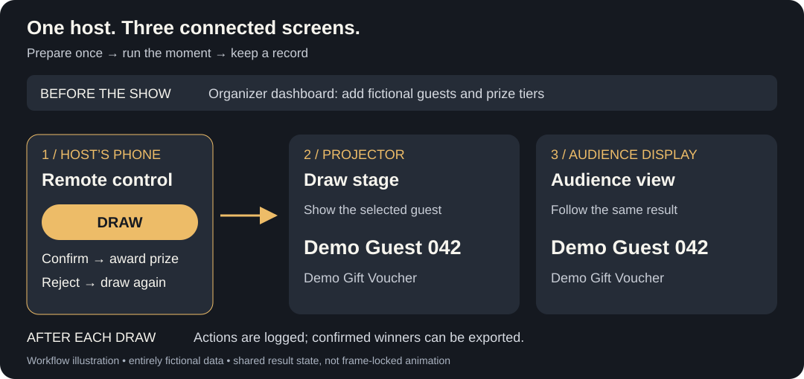

# Lucky Draw

**Run a live prize draw without juggling a spreadsheet, a projector and shouted instructions.**

An event organizer prepares participants and prizes once. The host runs the draw from a phone; the stage and audience views follow the same result. Confirm a winner or reject an unclaimed result, then keep going with a record of what happened.



*Workflow illustration, not a screenshot. All labels are fictional.*

## Understand it in 30 seconds

1. **Prepare:** add participants and prize tiers in the organizer dashboard. Bilingual participant labels are supported.
2. **Run:** open the stage on a projector, the remote on the host’s phone, and the audience view on another display. Select a tier and tap **DRAW**.
3. **Resolve:** confirm the winner, or reject an unclaimed result and draw again. Confirming awards the prize; rejecting leaves it available. The organizer can review confirmed winners afterward.

The intended outcome is less coordination during the event and a clear handover afterward. This repo does not claim measured time savings or live-event scale results.

**Explore:** [80-second demo script](docs/DEMO_VIDEO.md) · [Try with fake data](docs/QUICKSTART.md) · [Engineering evidence and limits](docs/ENGINEERING.md)

## Try it locally

Requires **Node.js 22, pnpm 10.22.0, a disposable Convex development deployment and Clerk development keys**. The current app is not an account-free demo. No Stripe setup is needed for the draw.

```bash
git clone https://github.com/Calvin1921/luckydraw.git
cd luckydraw
pnpm install --frozen-lockfile
cp .env.example .env.local
```

[Finish the one-time service configuration](docs/QUICKSTART.md#configure-the-development-services), then:

```bash
pnpm dev
# In another terminal, after Convex reports ready:
pnpm demo:seed
```

The seed creates **100 fictional guests, 3 prize tiers and 14 prizes** in a new event and returns the four routes to open at `http://localhost:3000`. Three browser windows on one laptop are enough to try the live workflow. Running the seed again creates a fresh event without resetting earlier draws.

## What the project demonstrates

| Product concern | Supporting implementation |
|---|---|
| Everyone follows the same result | Convex reactive queries share session state across the stage, remote and audience views. |
| A mistaken confirmation matters | The remote asks for a second tap to confirm or reject; the server checks session state and the supplied token. |
| The organizer needs a record | Drawn, confirmed and rejected actions create log entries; confirmed results appear in the dashboard. |
| People use different devices and motion settings | Responsive controls, bilingual labels, loading/empty/error states, and a static reduced-motion path in the Nova scene. These are implementation evidence, not a WCAG certification. |
| A convincing demo needs honest boundaries | Owner checks protect participant contact records and confirmed logs when bypass is off. Public session queries still expose control tokens; real-event deployment needs stronger authorization. |

This is a **product-engineering example**, with no LLM dependency. Its relevance to AI product work is problem framing, shared state, human confirmation, observable outcomes and explicit operating limits.

## Implementation, briefly

Next.js 15 · React 19 · TypeScript · Convex · Clerk · Tailwind CSS · Vitest. Nova uses GSAP, Framer Motion and canvas for the reveal; visual effects are secondary to operating the event.

**Demo-stage security boundary:** knowing an event ID can currently lead to remote control. Token validation alone does not make the remote private. Development bypass flags disable access checks and are not automatically blocked in production. Use fake data on an isolated development deployment. [Read the exact boundaries and next steps](docs/ENGINEERING.md#security-and-production-boundaries).

```bash
pnpm typecheck
pnpm lint
pnpm test
pnpm build
```

CI is configured to run these checks on pull requests and pushes to `main`. [Documentation map](docs/README.md) separates current reviewer guides from historical design and review notes.
