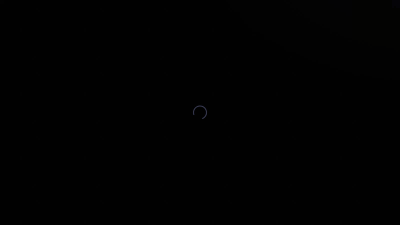
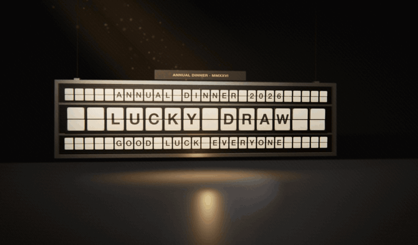
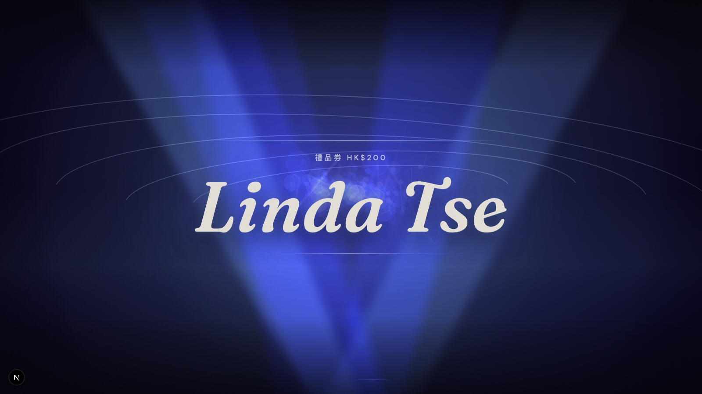
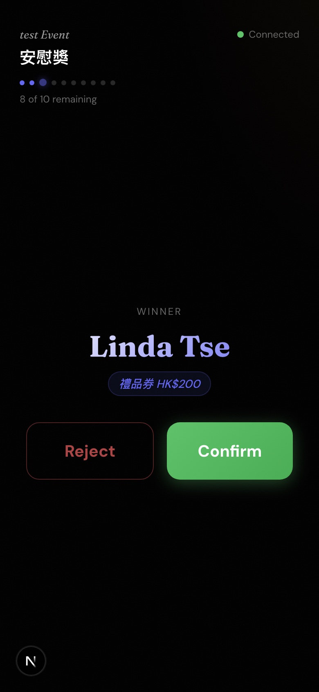
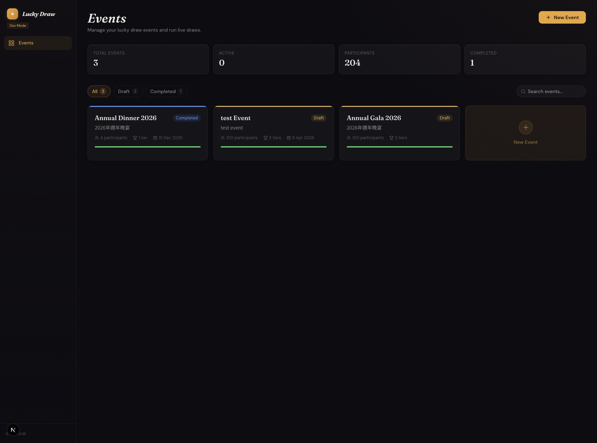

# Lucky Draw

A standalone lucky-draw product for live events — company parties, annual dinners,
weddings, meetups. Load your participant list, put the draw stage on the big screen,
and run the prize moment as a cinematic sequence. One organizer laptop drives three
synced screens: the draw stage on the projector, a remote control on the host's
phone, and an audience view. Bilingual names (Traditional Chinese + Latin) are a
first-class case on every surface.

| In-app draw scene (Nova) | Split-flap ceremony prototype |
|---|---|
|  |  |

| Draw stage (projector) | Phone remote | Organizer dashboard |
|---|---|---|
|  |  |  |

## Why

Running a draw at a real event usually means a spreadsheet and an awkward pause.
The moment deserves better: the reveal is the emotional peak of the night. Lucky
Draw turns it into a staged sequence — the host presses one button on their phone,
the projector runs a choreographed reveal, and the winner is logged with an audit
trail. If the winner isn't in the room, one tap rejects and redraws.

## How it works

Three routes subscribe to the same Convex query (`draw.getSession`). A mutation
from the phone remote changes the session state; the stage and audience screens
re-render automatically. There is no WebSocket plumbing in the app code — Convex
reactive queries carry the realtime sync.

```
Phone remote ──mutation──▶ Convex drawSession
                               │
              ┌────────────────┼────────────────┐
        Stage useQuery   Remote useQuery   Audience useQuery
```

Winner selection is a pure function: Fisher-Yates over the eligible pool, seeded
from `crypto.getRandomValues` (`lib/draw-algorithm.ts`). Every confirmed winner is
written to an audit log (`convex/winnerLogs.ts`), and draw mutations validate a
per-session remote token server-side (`convex/draw.ts`).

## The motion system

The draw scene (`components/draw/NovaDraw.tsx`) layers three tools, each doing the
job it is best at:

- **GSAP** owns the draw timeline — the two-phase choreography (fast name cycling,
  then deceleration into the reveal) needs programmatic timeline control.
- **Framer Motion** owns UI enter/exit transitions — the winner card, dashboard
  panels, page fades.
- **A canvas particle renderer** owns the atmosphere — beams, bloom and particle
  drift behind the typography.

### Direction reference: the split-flap ceremony

The locked motion direction for the draw stage is a physically-real Solari
split-flap departure board, filmed like a movie — spin-up, decelerating
left-to-right slam-locks, a half-flip tremble on the final letter, then a
camera pull-back to the full winner board. It exists today as a standalone
three.js prototype (PBR materials, depth of field, bloom, film grain; not yet
integrated into the app) and serves as the quality bar the production scene
is built toward — shown side by side with the current scene at the top of
this page.

## Accessibility

Motion is treated as a preference, not a default. The scene checks
`prefers-reduced-motion` through a hook (`lib/hooks.ts`):

```tsx
export function useReducedMotion(): boolean {
  const [reduced, setReduced] = useState(false);
  useEffect(() => {
    const mq = window.matchMedia("(prefers-reduced-motion: reduce)");
    setReduced(mq.matches);
    // ...
  }, []);
  return reduced;
}
```

When it returns true, `NovaDraw` skips the entire canvas + GSAP pipeline and
renders a static winner reveal on a plain gradient — not a slowed-down animation,
a different rendering path. A global CSS fallback (`app/globals.css`) also clamps
animation and transition durations under the same media query. Interactive
surfaces carry ARIA roles and labels throughout (97 `aria-` attributes across
`app/` and `components/`).

## States

Dashboard pages ship skeleton loading, empty, and error states — the events list,
event overview, participants and prizes pages each render a skeleton while Convex
queries resolve, an empty state with a call to action, and error boundaries at
each level (`app/error.tsx`, `app/(dashboard)/events/[eventId]/error.tsx`,
`app/draw/[eventId]/error.tsx`, plus `app/not-found.tsx`).

## Stack

Next.js 15 (App Router) · React 19 · TypeScript · Convex (database, server
functions, realtime) · Clerk (auth + organizations) · Tailwind CSS · GSAP ·
Framer Motion · Vitest

## Running it

```bash
pnpm install
npx convex dev        # first run provisions a dev deployment and fills .env.local
pnpm dev              # next dev + convex dev
```

Auth needs a (free) Clerk application — put its keys in `.env.local` (see
`.env.example`). For a quick local demo without a Clerk account, set
`NEXT_PUBLIC_DEV_BYPASS_AUTH=true`, which makes all routes public via
`middleware.ts` (dev only — never in production). Seed demo data with:

```bash
npx convex run seed:seedDemoData
```

`pnpm test` runs the unit tests (draw algorithm, CSV import, access control). CI runs
typecheck, lint, tests and a production build on every push; the build uses
placeholder Clerk/Convex values since prerendering only needs them to exist.

## Docs

- [`docs/`](docs/) — objective, PRD, architecture, design language, QA status,
  user journeys, and a code-level [security review](docs/SECURITY_REVIEW_FINDINGS.md)
- [`docs/design-review/`](docs/design-review/) — the capture-review-iterate trail
  behind the draw scene's visual development
