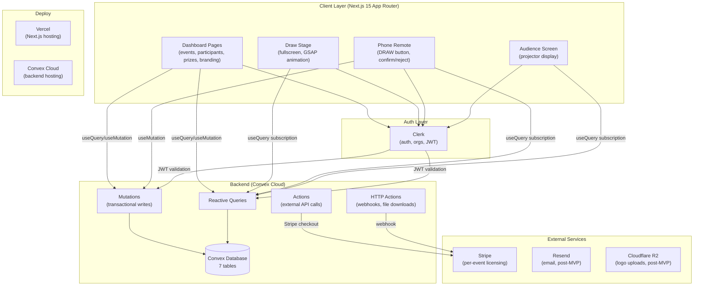
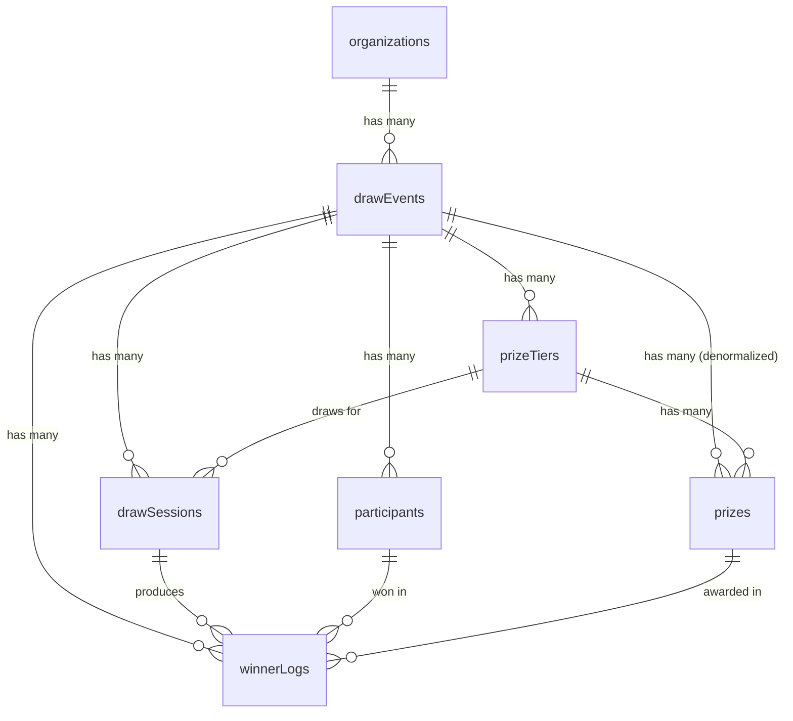
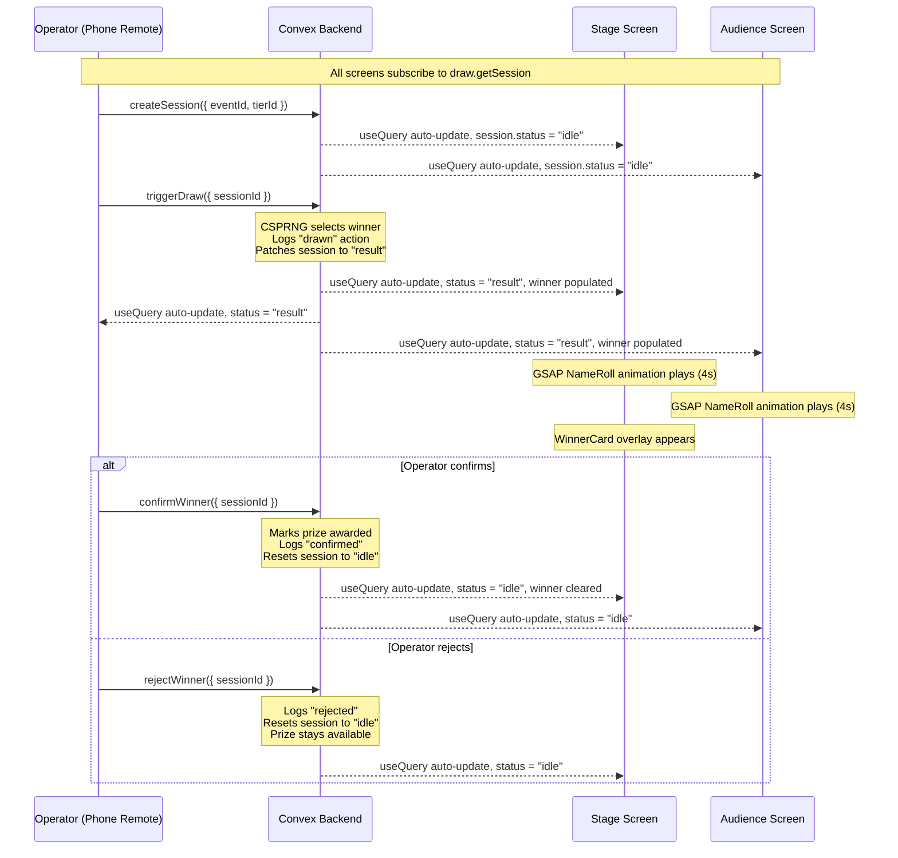
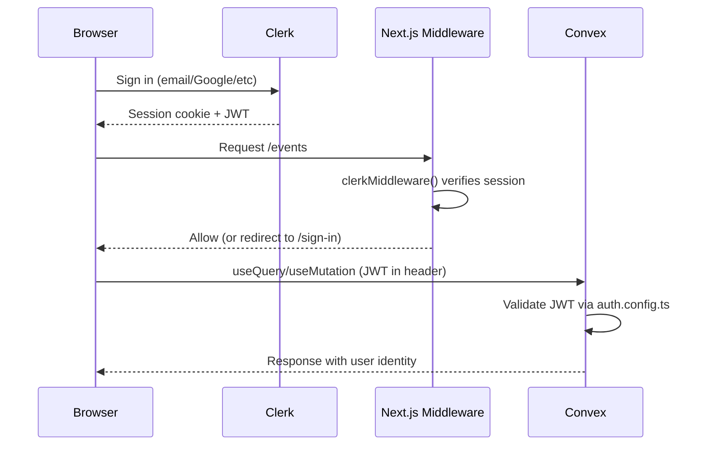
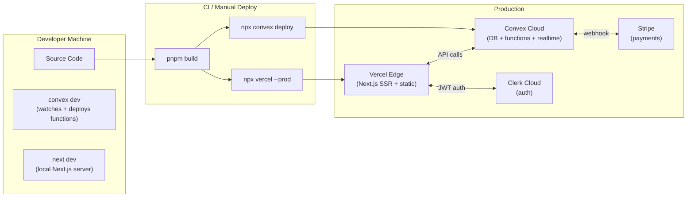

# Architecture: Lucky Draw MVP

> **Written:** 2026-04-08 as the pre-build architecture + threat model. The Security
> Model section below is the *planning-time* threat model — its CRITICAL conditions
> (org-ownership guards, `internalMutation` for license activation, PII projection on
> the draw surfaces) were requirements for the build, and are now implemented; see
> [SECURITY_REVIEW_FINDINGS.md](./SECURITY_REVIEW_FINDINGS.md) for the current
> post-implementation status.

## Document Suite

| Document | Purpose |
|----------|---------|
| [OBJECTIVE.md](./OBJECTIVE.md) | Vision, mission, target user, product principles |
| [PRD.md](./PRD.md) | Feature matrix with status + acceptance criteria |
| [DESIGN.md](./DESIGN.md) | Visual language, color tokens, component patterns |
| **ARCHITECTURE.md** | **System design (this document)** |
| [QA.md](./QA.md) | Quality status, release gates, test coverage |
| [JOURNEY.md](./JOURNEY.md) | User journey maps (setup, draw night, post-event) |
| [TODO.md](./TODO.md) | Prioritized backlog (bugs, security, tech debt) |

---

## System Overview



### Realtime Architecture

All three draw screens (stage, remote, audience) subscribe to the **same Convex query** (`draw.getSession`). When a mutation changes session state, every subscriber re-renders automatically. No Pusher, no WebSocket management, no event channels.

```
Remote (phone) ──useMutation──▶ Convex triggerDraw mutation
                                    │
                                    ▼
                              DB patch: session.status = "result"
                                    │
                                    ▼
                    ┌───────────────┼───────────────┐
                    │               │               │
              Stage useQuery   Remote useQuery  Audience useQuery
              (auto re-render) (auto re-render) (auto re-render)
```

---

## Tech Stack

| Layer | Choice | Rationale |
|-------|--------|-----------|
| Framework | Next.js 15 (App Router) | Server/client component model, TypeScript first, Vercel deploy |
| Backend | Convex | Replaces Prisma + Neon + Pusher with one service: DB + server functions + realtime. Type-safe end-to-end |
| Auth | Clerk | Drop-in auth with org support, JWT integration with Convex, Clerk Elements for custom UI |
| Animation | GSAP | Programmatic timeline control needed for 2-phase draw (fast scroll then deceleration). CSS animations lack this precision |
| UI Transitions | Framer Motion | Declarative enter/exit animations for React components (WinnerCard overlay) |
| Styling | Tailwind CSS + shadcn/ui | Utility-first, no runtime CSS, accessible component primitives |
| Payments | Stripe (Checkout) | Per-event licensing via Checkout Session + webhook |
| Email | Resend | Post-MVP: winner notification emails |
| Storage | Cloudflare R2 | Post-MVP: logo uploads for event branding |
| Monorepo | Turborepo | Originally developed in a Turborepo workspace; extracted to a standalone repo |
| Testing | Vitest | Fast, ESM-native, compatible with Convex test patterns |
| Deploy | Vercel + Convex Cloud | Zero-config Next.js deploy; Convex handles backend infra |

---

## Directory / File Structure

```
luckydraw/
    ├── package.json
    ├── next.config.ts
    ├── tailwind.config.ts
    ├── tsconfig.json
    ├── vitest.config.ts
    ├── middleware.ts                      ← Clerk auth middleware
    │
    ├── convex/                            ← All backend logic
    │   ├── _generated/                    ← Auto-generated by Convex CLI
    │   ├── schema.ts                      ← All table definitions
    │   ├── auth.config.ts                 ← Clerk + Convex auth bridge
    │   ├── organizations.ts               ← Org queries + mutations
    │   ├── events.ts                      ← DrawEvent CRUD + Stripe checkout action
    │   ├── participants.ts                ← Participant import + management
    │   ├── prizes.ts                      ← PrizeTier + Prize CRUD
    │   ├── draw.ts                        ← Draw session + trigger + confirm/reject
    │   ├── winnerLogs.ts                  ← Audit log queries
    │   └── http.ts                        ← HTTP actions (Stripe webhook, CSV download)
    │
    ├── app/
    │   ├── layout.tsx                     ← Root (ClerkProvider + ConvexProvider)
    │   ├── page.tsx                       ← Redirect to /events
    │   ├── (auth)/
    │   │   ├── sign-in/[[...sign-in]]/page.tsx
    │   │   └── sign-up/[[...sign-up]]/page.tsx
    │   ├── (dashboard)/
    │   │   ├── layout.tsx                 ← Sidebar + org sync
    │   │   ├── events/
    │   │   │   ├── page.tsx               ← Event list
    │   │   │   ├── new/page.tsx           ← Create event form
    │   │   │   └── [eventId]/
    │   │   │       ├── page.tsx           ← Event dashboard
    │   │   │       ├── participants/page.tsx
    │   │   │       ├── prizes/page.tsx
    │   │   │       └── branding/page.tsx
    │   │   └── draw/
    │   │       └── [eventId]/
    │   │           ├── stage/page.tsx      ← Fullscreen draw stage
    │   │           ├── remote/page.tsx     ← Phone remote controller
    │   │           └── audience/page.tsx   ← Projector screen
    │   └── api/
    │       └── webhooks/stripe/route.ts   ← (unused — Stripe webhook goes to Convex HTTP action)
    │
    ├── components/
    │   ├── draw/
    │   │   ├── DrawEngine.tsx             ← GSAP animation + Convex subscription
    │   │   ├── NameRoll.tsx               ← Spinning name strip (GSAP timeline)
    │   │   └── WinnerCard.tsx             ← Winner reveal overlay (Framer Motion)
    │   └── providers/
    │       └── ConvexClientProvider.tsx    ← ConvexProviderWithClerk wrapper
    │
    ├── lib/
    │   ├── draw-algorithm.ts              ← CSPRNG Fisher-Yates (pure function)
    │   ├── csv-parser.ts                  ← Participant CSV parsing + validation
    │   └── utils.ts                       ← cn() helper
    │
    └── tests/
        ├── draw-algorithm.test.ts
        ├── csv-parser.test.ts
        └── setup.ts
```

---

## Database Schema

### Entity-Relationship Map



### Table Definitions

#### `organizations`

| Field | Type | Purpose |
|-------|------|---------|
| `clerkOrgId` | `v.string()` | Clerk org ID or `"user_{userId}"` for personal accounts |
| `name` | `v.string()` | Display name |
| `slug` | `v.string()` | URL-safe identifier |
| `plan` | `v.union("per_event", "agency", "enterprise")` | Billing tier (MVP: always "per_event") |

**Indexes:**
- `by_clerk_org_id` on `[clerkOrgId]` — lookup on every authenticated request
- `by_slug` on `[slug]` — future: public event pages

#### `drawEvents`

| Field | Type | Purpose |
|-------|------|---------|
| `orgId` | `v.id("organizations")` | Owner org |
| `name` | `v.string()` | English event name |
| `nameZh` | `v.optional(v.string())` | Traditional Chinese name |
| `status` | `v.union("draft", "active", "completed", "archived")` | Lifecycle state |
| `eventDate` | `v.optional(v.number())` | Unix ms timestamp |
| `licenseExpiresAt` | `v.optional(v.number())` | Stripe license expiry (Unix ms) |
| `stripeSessionId` | `v.optional(v.string())` | Stripe Checkout session reference |
| `primaryColor` | `v.string()` | Branding hex color (default: `#6366f1`) |
| `locale` | `v.union("en", "zh-HK", "both")` | Display language |
| `logoUrl` | `v.optional(v.string())` | Event logo (post-MVP: R2 upload) |

**Index:** `by_org` on `[orgId]` — list events for an org

**Design decision:** Branding fields inlined (no separate table). Document DB allows this without normalization penalty. A separate table would add an extra query for every event load.

#### `participants`

| Field | Type | Purpose |
|-------|------|---------|
| `eventId` | `v.id("drawEvents")` | Parent event |
| `name` | `v.string()` | English name (required) |
| `nameZh` | `v.optional(v.string())` | Chinese name |
| `email` | `v.optional(v.string())` | Contact email |
| `phone` | `v.optional(v.string())` | Contact phone |
| `importSource` | `v.union("manual", "csv", "external")` | How they were added |
| `isEligible` | `v.boolean()` | Can be drawn (default: true) |

**Indexes:**
- `by_event` on `[eventId]` — load all participants for an event
- `by_event_eligible` on `[eventId, isEligible]` — efficient eligible pool query during draws (avoids full-scan filter at scale)

#### `prizeTiers`

| Field | Type | Purpose |
|-------|------|---------|
| `eventId` | `v.id("drawEvents")` | Parent event |
| `name` | `v.string()` | Tier name (e.g., "Grand Prize") |
| `nameZh` | `v.optional(v.string())` | Chinese tier name |
| `drawOrder` | `v.number()` | Sequence in which tiers are drawn |
| `allowRepeat` | `v.boolean()` | Whether a winner can win again in this tier |

**Index:** `by_event` on `[eventId]` — list tiers for an event

#### `prizes`

| Field | Type | Purpose |
|-------|------|---------|
| `tierId` | `v.id("prizeTiers")` | Parent tier |
| `eventId` | `v.id("drawEvents")` | **Denormalized** — avoids tier lookup for event-level prize queries |
| `name` | `v.string()` | Prize name |
| `nameZh` | `v.optional(v.string())` | Chinese prize name |
| `description` | `v.optional(v.string())` | Additional details |
| `isAwarded` | `v.boolean()` | Whether this prize has been given out |

**Indexes:**
- `by_tier` on `[tierId]` — list prizes within a tier
- `by_event` on `[eventId]` — query all prizes for an event

**Denormalization rationale:** `eventId` is duplicated from the parent tier to avoid a two-step query (tier then prizes) when checking remaining prizes during draws. Acceptable because prizes are created alongside tiers and the eventId never changes.

#### `drawSessions`

| Field | Type | Purpose |
|-------|------|---------|
| `eventId` | `v.id("drawEvents")` | Parent event |
| `tierId` | `v.id("prizeTiers")` | Which tier this session draws for |
| `status` | `v.union("idle", "spinning", "result", "confirmed", "rejected", "closed")` | Session state machine |
| `remoteToken` | `v.string()` | UUID for remote controller URL (unguessable) |
| `algorithm` | `v.string()` | Algorithm identifier for audit (e.g., `"fisher-yates-webcrypto-v1"`) |
| `prngSeed` | `v.optional(v.string())` | Hex seed logged for auditability |
| `currentWinnerId` | `v.optional(v.id("participants"))` | Winner of current draw (set in "result" state) |
| `currentPrizeId` | `v.optional(v.id("prizes"))` | Prize being awarded (set in "result" state) |
| `currentResultId` | `v.optional(v.id("winnerLogs"))` | Log entry reference |

**Indexes:**
- `by_event` on `[eventId]` — find active session for an event
- `by_remote_token` on `[remoteToken]` — authenticate remote controller

**State machine (MVP):**
```
idle ──(triggerDraw)──▶ result ──(confirmWinner)──▶ idle (prize awarded)
                          │
                          └──(rejectWinner)──▶ idle (prize NOT awarded, redraw possible)
```

> Note: `spinning`, `confirmed`, `rejected`, `closed` are defined in the schema for future use but the MVP transitions directly: `idle` to `result` to `idle`. The animation is client-side; the server only knows `idle` and `result`.

#### `winnerLogs`

| Field | Type | Purpose |
|-------|------|---------|
| `eventId` | `v.id("drawEvents")` | Parent event |
| `sessionId` | `v.id("drawSessions")` | Which session produced this log |
| `participantId` | `v.id("participants")` | Winner reference |
| `prizeId` | `v.id("prizes")` | Prize reference |
| `participantName` | `v.string()` | **Denormalized** — log is self-contained |
| `participantNameZh` | `v.optional(v.string())` | **Denormalized** — Chinese name for bilingual CSV |
| `participantEmail` | `v.optional(v.string())` | **Denormalized** — for winner notification (post-MVP) |
| `prizeName` | `v.string()` | **Denormalized** — survives participant/prize deletion |
| `prizeNameZh` | `v.optional(v.string())` | **Denormalized** — Chinese prize name |
| `tierName` | `v.string()` | **Denormalized** — tier name for grouped reports |
| `action` | `v.union("drawn", "confirmed", "rejected", "replaced")` | What happened |
| `actorUserId` | `v.optional(v.string())` | Clerk user ID — **must be server-derived from `ctx.auth`, not client-supplied** |

**Indexes:**
- `by_event` on `[eventId]` — list all logs for an event
- `by_event_action` on `[eventId, action]` — efficient query for confirmed-only logs (CSV export, winner list)

**Additional denormalized fields (from database architect review):**
- `participantNameZh` — Chinese name snapshot for bilingual CSV export
- `participantEmail` — email snapshot for winner notification (post-MVP)
- `prizeNameZh` — Chinese prize name snapshot
- `tierName` — tier name snapshot for grouped winner reports

**Denormalization rationale:** `participantName`, `prizeName`, and related fields are copied at write time so the audit trail remains readable even if participants or prizes are deleted. This is critical for PDPO compliance — the log must be independently interpretable. The additional fields ensure the CSV export can produce a complete bilingual report from a single table query with zero joins.

### Capacity Analysis

**MVP target: 300 participants per event.**

| Operation | Pattern | At 300 participants |
|-----------|---------|---------------------|
| `participants.list` | `.withIndex("by_event").collect()` | 300 docs, ~150KB. Well within limits |
| `triggerDraw` | `.withIndex("by_event").collect()` + filter eligible | 300 docs read + filter. Under 8MB transaction limit |
| `events.list` | `.withIndex("by_org").collect()` + per-event participant count | N+1 pattern (1 query + N subqueries). Acceptable for <50 events |
| `prizes.listTiers` | `.withIndex("by_event").collect()` + per-tier prizes | N+1. Acceptable: typically <10 tiers with <5 prizes each |
| `winnerLogs.listConfirmed` | `.withIndex("by_event").collect()` + filter | Grows linearly per event but bounded by prize count |
| `bulkImport` | `Promise.all(300 inserts)` | 300 inserts in one mutation. Within 8MB limit. Convex caps at 4096 writes/tx — chunk at 500 for larger imports |

**Scaling concern (post-MVP):** The N+1 pattern in `events.list` (fetching participant count per event) could become slow at >100 events. Mitigation: denormalize a `participantCount` field onto `drawEvents`.

**No concern at 300:** `.collect()` on 300 small documents is trivially fast in Convex.

---

## API Contracts

### organizations.ts

#### `organizations.ensureOrg` (mutation)
- **Args:** `{ name: v.string() }` — **`clerkOrgId` must be derived from `ctx.auth.getUserIdentity()`, not accepted as a client argument (REQ-13)**
- **Returns:** `Id<"organizations">`
- **Auth:** Yes (called from dashboard layout on login)
- **Behavior:** Idempotent upsert — reads `clerkOrgId` from auth identity, finds by index or inserts new. Generates slug. Default plan: `"per_event"`
- **Side effects:** May insert into `organizations`

#### `organizations.getByClerkOrgId` (query)
- **Args:** `{ clerkOrgId: v.string() }`
- **Returns:** `Organization | null`
- **Auth:** Yes
- **Reactive:** Yes — dashboard pages subscribe to this

### events.ts

#### `events.list` (query)
- **Args:** `{ orgId: v.id("organizations") }`
- **Returns:** `Array<DrawEvent & { participantCount: number, tierCount: number }>`
- **Auth:** Yes
- **Reactive:** Yes — events list page

#### `events.get` (query)
- **Args:** `{ eventId: v.id("drawEvents") }`
- **Returns:** `DrawEvent | null`
- **Auth:** No (used by draw screens which may be unauthenticated)
- **Reactive:** Yes — event detail, stage, remote, audience pages

#### `events.create` (mutation)
- **Args:** `{ orgId: v.id("organizations"), name: v.string(), nameZh?: v.optional(v.string()), eventDate?: v.optional(v.number()) }`
- **Returns:** `Id<"drawEvents">`
- **Auth:** Yes
- **Errors:** Throws if name is empty
- **Defaults:** `status: "draft"`, `primaryColor: "#6366f1"`, `locale: "en"`

#### `events.updateBranding` (mutation)
- **Args:** `{ eventId: v.id("drawEvents"), primaryColor: v.string(), locale: v.union("en", "zh-HK", "both"), logoUrl?: v.optional(v.string()) }`
- **Returns:** `void`
- **Auth:** Yes

#### `events.remove` (mutation)
- **Args:** `{ eventId: v.id("drawEvents") }`
- **Returns:** `void`
- **Auth:** Yes
- **Side effects:** Cascade deletes: participants, prizeTiers, prizes, drawSessions, winnerLogs, then the event itself

#### `events.activateLicense` (`internalMutation` — NOT public mutation)
- **Args:** `{ eventId: v.id("drawEvents"), expiresAt: v.number() }`
- **Returns:** `void`
- **Auth:** Internal only — **must use `internalMutation()` not `mutation()` to prevent direct client calls (REQ-02)**. Called exclusively from Stripe webhook HTTP action via `ctx.runMutation(internal.events.activateLicense, ...)`
- **Side effects:** Sets event status to `"active"`, sets `licenseExpiresAt`

#### `events.createCheckoutSession` (action)
- **Args:** `{ eventId: v.id("drawEvents") }`
- **Returns:** `string` (Stripe Checkout URL)
- **Auth:** Yes
- **Side effects:** Creates Stripe Checkout Session, stores session ID on event via `setStripeSession` mutation

#### `events.setStripeSession` (mutation)
- **Args:** `{ eventId: v.id("drawEvents"), stripeSessionId: v.string() }`
- **Returns:** `void`
- **Auth:** Internal

### participants.ts

#### `participants.list` (query)
- **Args:** `{ eventId: v.id("drawEvents") }`
- **Returns:** `Participant[]`
- **Auth:** No (used by draw screens)
- **Reactive:** Yes — participants page, stage, remote, audience

#### `participants.bulkImport` (mutation)
- **Args:** `{ eventId: v.id("drawEvents"), participants: v.array(v.object({ name, nameZh?, email?, phone? })), importSource: v.union("csv", "external") }`
- **Returns:** `{ imported: number }`
- **Auth:** Yes
- **Side effects:** Inserts all participants with `isEligible: true`

#### `participants.add` (mutation)
- **Args:** `{ eventId: v.id("drawEvents"), name: v.string(), nameZh?, email?, phone? }`
- **Returns:** `Id<"participants">`
- **Auth:** Yes
- **Errors:** Throws if name is empty

#### `participants.remove` (mutation)
- **Args:** `{ participantId: v.id("participants") }`
- **Returns:** `void`
- **Auth:** Yes

### prizes.ts

#### `prizes.listTiers` (query)
- **Args:** `{ eventId: v.id("drawEvents") }`
- **Returns:** `Array<PrizeTier & { prizes: Prize[] }>` (tiers ordered by drawOrder asc, prizes nested)
- **Auth:** No (used by draw screens)
- **Reactive:** Yes

#### `prizes.createTier` (mutation)
- **Args:** `{ eventId: v.id("drawEvents"), name: v.string(), nameZh?, drawOrder: v.number(), allowRepeat?: v.boolean() }`
- **Returns:** `Id<"prizeTiers">`
- **Auth:** Yes

#### `prizes.addPrize` (mutation)
- **Args:** `{ tierId: v.id("prizeTiers"), eventId: v.id("drawEvents"), name: v.string(), nameZh?, description? }`
- **Returns:** `Id<"prizes">`
- **Auth:** Yes

#### `prizes.removeTier` (mutation)
- **Args:** `{ tierId: v.id("prizeTiers") }`
- **Returns:** `void`
- **Auth:** Yes
- **Side effects:** Cascade deletes all prizes in the tier

### draw.ts

#### `draw.getSession` (query) — **CORE REALTIME QUERY**
- **Args:** `{ sessionId: v.id("drawSessions") }`
- **Returns:** `DrawSession & { tier: PrizeTier, winner: { _id, name, nameZh } | null, prize: Prize | null } | null`
- **Auth:** No
- **Reactive:** Yes — Stage, remote, and audience all subscribe. Any mutation that patches the session triggers re-render on all clients.
- **SECURITY (REQ-05):** Winner participant object MUST be projected to `{ _id, name, nameZh }` only — do NOT return `email`, `phone`, or other PII to unauthenticated stage/audience screens. Similarly, `remoteToken` must NOT be included in the response to stage/audience views.

#### `draw.getSessionByToken` (query)
- **Args:** `{ remoteToken: v.string() }`
- **Returns:** `DrawSession | null`
- **Auth:** No (remote uses token-based auth)
- **Reactive:** Yes

#### `draw.getActiveSession` (query)
- **Args:** `{ eventId: v.id("drawEvents") }`
- **Returns:** `DrawSession | null` (most recent non-closed session)
- **Auth:** No
- **Reactive:** Yes

#### `draw.createSession` (mutation)
- **Args:** `{ eventId: v.id("drawEvents"), tierId: v.id("prizeTiers") }`
- **Returns:** `Id<"drawSessions">`
- **Auth:** Yes (triggered from stage page)
- **Side effects:** Generates `remoteToken` via `crypto.randomUUID()`, sets algorithm to `"fisher-yates-webcrypto-v1"`, status to `"idle"`

#### `draw.triggerDraw` (mutation) — **CRITICAL PATH**
- **Args:** `{ sessionId: v.id("drawSessions") }`
- **Returns:** `{ winnerId, prizeId, logId }`
- **Auth:** No (remote controller, authenticated by session token)
- **Preconditions:** Session status must be `"idle"`
- **Algorithm:**
  1. Load all participants for the event
  2. If tier `allowRepeat` is false, exclude previously confirmed winners in this tier
  3. Filter to eligible participants
  4. Find first unawarded prize in this tier
  5. CSPRNG selection: `crypto.getRandomValues(new Uint32Array(1))`, modulo pool size
  6. Log "drawn" action to `winnerLogs`
  7. Patch session: `status: "result"`, set winner/prize/log IDs, store seed
- **Errors:** "Session not found", "Cannot draw from status: X", "No eligible participants", "No prizes remaining in this tier"
- **Side effects:** Inserts into `winnerLogs`, patches `drawSessions`

#### `draw.confirmWinner` (mutation)
- **Args:** `{ sessionId: v.id("drawSessions"), actorUserId?: v.optional(v.string()) }`
- **Returns:** `void`
- **Auth:** No (remote controller)
- **Preconditions:** Session status must be `"result"` with winner data populated
- **Side effects:**
  1. Marks prize as `isAwarded: true`
  2. Inserts "confirmed" log into `winnerLogs`
  3. Resets session to `"idle"` (clears winner/prize/log IDs)
- **Errors:** "No pending result", "Session is missing winner data"

#### `draw.rejectWinner` (mutation)
- **Args:** `{ sessionId: v.id("drawSessions"), actorUserId?: v.optional(v.string()) }`
- **Returns:** `void`
- **Auth:** No (remote controller)
- **Preconditions:** Session status must be `"result"`
- **Side effects:**
  1. Inserts "rejected" log into `winnerLogs`
  2. Resets session to `"idle"` (prize NOT marked as awarded — stays available)
  3. Rejected participant remains eligible for redraw

### winnerLogs.ts

#### `winnerLogs.listConfirmed` (query)
- **Args:** `{ eventId: v.id("drawEvents") }`
- **Returns:** `WinnerLog[]` (filtered to `action === "confirmed"`, sorted by `_creationTime` asc)
- **Auth:** No (used by CSV export)

### http.ts (HTTP Actions)

#### `POST /webhooks/stripe`
- **Auth:** Stripe signature verification (`stripe.webhooks.constructEvent`)
- **Handles:** `checkout.session.completed` — extracts `eventId` from metadata, calls `events.activateLicense` with 30-day expiry
- **Returns:** 200 "ok" or 400 "Invalid signature"

#### `GET /export/winners?eventId=...`
- **Auth:** None (MVP — see Security Model for conditions)
- **Returns:** CSV file with headers: `No., Winner Name, Prize, Drawn At (HKT)`
- **Content-Type:** `text/csv; charset=utf-8`
- **Content-Disposition:** `attachment; filename="{eventName}-winners.csv"`
- **Errors:** 400 "Missing eventId", 404 "Event not found"

### Reactive Query Subscription Map

| Screen | Queries Subscribed | Purpose |
|--------|-------------------|---------|
| Dashboard Events | `organizations.getByClerkOrgId`, `events.list` | Show event list with counts |
| Event Detail | `events.get` | Show event info + draw links |
| Participants Mgmt | `participants.list` | Manage participant list |
| Prizes Mgmt | `prizes.listTiers` | Manage tier/prize structure |
| Branding | `events.get` | Load current branding settings |
| **Draw Stage** | `events.get`, `draw.getActiveSession`, `prizes.listTiers`, `participants.list`, **`draw.getSession`** | Full draw UI with animation |
| **Phone Remote** | `events.get`, `draw.getSessionByToken`, `participants.list`, **`draw.getSession`** | DRAW button + confirm/reject |
| **Audience Screen** | `events.get`, `draw.getActiveSession`, `participants.list`, **`draw.getSession`** | Mirror of stage animation |

### Draw Cycle Flow



---

## Auth Flow

### Clerk + Convex Integration



### Route Protection

| Route Pattern | Auth | Notes |
|---------------|------|-------|
| `/sign-in(.*)`, `/sign-up(.*)` | Public | Clerk hosted components |
| `/draw/(.*)/stage` | Public | Displayed on venue screen (no login) |
| `/draw/(.*)/audience` | Public | Displayed on projector |
| `/draw/(.*)/remote` | Public | Accessed via QR code on phone; token-based |
| `/api/webhooks/(.*)` | Public | Stripe signature verification |
| Everything else (`/events/*`, etc.) | **Protected** | Clerk `auth.protect()` |

### Organization Model

- Clerk organizations map 1:1 to Lucky Draw `organizations` table
- Personal accounts use `"user_{userId}"` as the `clerkOrgId`
- `ensureOrg` mutation is called on every dashboard layout mount (idempotent)
- Org switching in Clerk automatically scopes all Convex queries via the `orgId` chain

---

## Frontend Component Architecture

### Module Boundaries

```
┌─────────────────────────────────────────────┐
│ app/                                         │
│   Route pages — compose components + hooks   │
│   Can import: components/, lib/, convex/     │
├─────────────────────────────────────────────┤
│ components/                                  │
│   Presentational + stateful UI components    │
│   Can import: lib/, convex/ (for hooks)      │
│   Cannot import: app/ (no circular deps)     │
├─────────────────────────────────────────────┤
│ lib/                                         │
│   Pure functions, zero side effects          │
│   Can import: nothing project-internal       │
│   draw-algorithm.ts — CSPRNG selection       │
│   csv-parser.ts — CSV parsing + validation   │
│   utils.ts — cn() Tailwind helper            │
├─────────────────────────────────────────────┤
│ convex/                                      │
│   Server-side only (runs on Convex cloud)    │
│   Can import: convex/_generated/             │
│   Cannot import: components/, app/, lib/     │
│   (note: triggerDraw reimplements the draw   │
│    algorithm server-side, not importing it)  │
└─────────────────────────────────────────────┘
```

### Draw Engine Component Tree

```
DrawEngine (orchestrator)
├── props: sessionId, participants, primaryColor, isOperator, isStage
├── hooks: useQuery(draw.getSession), useMutation(triggerDraw/confirm/reject)
├── state: animationDone (boolean — only client state needed)
│
├── [if isStage] NameRoll
│   ├── props: participants, winner, isSpinning, primaryColor, onComplete
│   ├── GSAP timeline: 2-phase animation
│   │   Phase 1: fast scroll (2.2s, power2.in ease)
│   │   Phase 2: deceleration to winner (1.8s, power3.out ease)
│   └── Display: 5x repeated participant list, 7 visible items, center highlight
│
├── [if isStage && showWinner] WinnerCard
│   ├── props: winner, prize, primaryColor, isOperator, onConfirm, onReject
│   ├── Framer Motion: fade in + spring scale
│   └── Confirm/Reject buttons (only if isOperator && isStage)
│
└── [if !isStage] Remote Controller View
    ├── Large circular DRAW button (52x52, primaryColor)
    ├── Disabled when status !== "idle"
    └── Confirm/Reject buttons (Framer Motion entrance, delay 0.35s)
```

### State Management

| State Type | Where It Lives | Access Pattern |
|------------|---------------|----------------|
| Session state (status, winner, prize) | Convex DB via `useQuery` | Server state, auto-synced |
| Participant list | Convex DB via `useQuery` | Server state |
| Event config (color, locale) | Convex DB via `useQuery` | Server state |
| Animation progress | React `useState` (`animationDone`) | Client-only, per-component |
| Form inputs (new event, new prize) | React `useState` | Client-only, per-page |
| Auth state | Clerk via `useAuth()` | Clerk SDK manages |

**Key principle:** Convex reactive queries replace the need for client-side state management (Redux, Zustand). The server is the single source of truth. Client state is limited to animation flags and form inputs.

---

## Security Model

### Threat Model

| Threat | Mitigation | Risk Level |
|--------|------------|------------|
| **IDOR — cross-org data access** | Plan has NO org ownership checks in mutations. Any authed user can pass any `eventId`. **CONDITION: Add `assertOrgOwnership()` to every mutation** | Critical |
| **License bypass** | `activateLicense` is a public mutation — any user can activate without paying. **CONDITION: Change to `internalMutation()`** | Critical |
| **PII leak via `getSession`** | Full participant objects (including email/phone) returned to unauthed stage/audience. **CONDITION: Project to `{_id, name, nameZh}` only** | Critical |
| **Draw manipulation** (predicting winner) | CSPRNG via `crypto.getRandomValues()`, server-side execution in Convex mutation (not client-side) | Low |
| **Unauthorized draw trigger** | Remote token guards the page route but NOT the Convex mutations. `triggerDraw`/`confirmWinner`/`rejectWinner` can be called directly with just a `sessionId`. **CONDITION: Validate remoteToken inside mutations** | High |
| **Session hijacking on remote** | Remote token is a UUID (122 bits of entropy). Rotated per session. Not guessable. Short-lived (per draw event) | Low |
| **Stripe webhook spoofing** | `stripe.webhooks.constructEvent` signature verification with HMAC | Low |
| **Winner CSV data leak** | MVP: CSV export endpoint has no auth. **CONDITION: Add auth token or signed URL before production** | High |
| **XSS via participant names** | React auto-escapes JSX. CSV import is parsed server-side (Convex mutation). Names displayed via React text content, not raw HTML | Low |
| **CSV injection** | CSV export wraps cells in quotes, but quoting alone does NOT prevent Excel/Sheets from executing formulas like `=HYPERLINK(...)`. **CONDITION: Sanitize on import and export (strip leading `=+\-@`)** | Medium |
| **PDPO (HK data privacy)** | Winner logs denormalize names for audit trail. Participant PII (email, phone) is optional and stored only in Convex (encrypted at rest). No PII in logs beyond name | Low |
| **Cascade deletion data loss** | `events.remove` deletes all child records including audit trail. **CONDITION: Soft-delete required** | High |
| **Audit trail tampering** | `winnerLogs` are append-only (no update/delete mutations exposed). `_creationTime` is system-generated | Low |
| **Content-Disposition header injection** | `event.name` interpolated into CSV download header unsanitized. **CONDITION: Sanitize before interpolation** | Medium |
| **triggerDraw rate limiting** | No server-side throttle — rapid calls can fish for preferred winners. **CONDITION: 3s minimum between draws** | Medium |
| **activateLicense ownership check** | Stripe webhook calls `activateLicense` with eventId from metadata — no ownership verification | Medium |
| **actorUserId is caller-supplied** | `confirmWinner`/`rejectWinner` trust client-supplied `actorUserId`. Should derive from `ctx.auth` once auth is added | Low |

### Security Conditions (must be resolved before production with real participant data)

**CRITICAL — Must fix before any development proceeds:**

1. **CRITICAL — IDOR: No org ownership verification in mutations (REQ-01)** — The plan's Convex mutations have ZERO `ctx.auth.getUserIdentity()` calls. Any authenticated user can read/write any org's data by passing a foreign `eventId`. **Every mutation that takes an `eventId` or `orgId` must verify the caller's Clerk org matches the record's org.** Implementation: create a shared `assertOrgOwnership(ctx, eventId)` helper that reads the event, resolves its org, compares against `ctx.auth.getUserIdentity().orgId`, and throws if mismatched.

2. **CRITICAL — License bypass: `activateLicense` must be `internalMutation` (REQ-02)** — As written, `activateLicense` is a public mutation. Any authenticated user can call it directly to activate any event's license without paying. Fix: change from `mutation()` to `internalMutation()` so it can only be called by the Stripe webhook HTTP action via `ctx.runMutation()`.

3. **CRITICAL — PII leak in `getSession` (REQ-05)** — `draw.getSession` returns full participant objects to unauthenticated stage/audience screens, including `email` and `phone` fields. Fix: project participant data to `{ _id, name, nameZh }` only — strip PII before returning.

4. **CRITICAL — CSV export auth (REQ-06)** — `GET /export/winners` has no authentication. Anyone with an `eventId` can download winner names. Add Clerk JWT validation in the HTTP action or signed URLs with HMAC + expiry. Must return 401 for unauthenticated requests.

**HIGH — Must fix during development:**

5. **HIGH — `ensureOrg` must use identity claims (REQ-13)** — The current plan accepts `clerkOrgId` as a client-supplied argument. A malicious client can pass any org ID. Fix: read the org identity from `ctx.auth.getUserIdentity()` server-side instead of trusting the client argument.

6. **HIGH — Server-side auth on draw mutations (REQ-03)** — `triggerDraw`, `confirmWinner`, `rejectWinner` accept only `sessionId` with no authorization check. The `remoteToken` guards the page route but not the Convex mutations. Fix: add `remoteToken: v.string()` as a required argument and verify `session.remoteToken === args.remoteToken` inside each mutation handler. Ensure `remoteToken` is never returned to stage/audience queries.

7. **HIGH — Soft-delete for events** — `events.remove` cascade-deletes `winnerLogs` (audit trail). Replace with soft-delete: add `archivedAt` timestamp to `drawEvents`, filter from list queries, never delete `winnerLogs`. Retain logs for minimum 12 months (PDPO).

8. **HIGH — `actorUserId` must be server-derived (REQ-04)** — `confirmWinner`/`rejectWinner` currently accept `actorUserId` as a client argument. Fix: derive from `ctx.auth.getUserIdentity()` server-side once auth is added to these mutations.

**MEDIUM — Fix before production deploy:**

9. **MEDIUM — Participant limit enforcement (REQ-07)** — The 300-participant MVP limit must be enforced at the Convex layer in `bulkImport` and `add` mutations, not just in the UI.
10. **MEDIUM — Sanitize Content-Disposition header (REQ-08)** — CSV export interpolates `event.name` into `Content-Disposition` header. Sanitize: `event.name.replace(/[^a-zA-Z0-9._-]/g, '_')`.
11. **MEDIUM — Rate limit triggerDraw** — No server-side throttle. Add `lastDrawAt` field to `drawSessions`, reject calls within 3 seconds of previous draw to prevent rapid-fire fishing or accidental spam.
12. **MEDIUM — CSV injection sanitization (REQ-08)** — Sanitize participant names on import (strip leading `=`, `+`, `-`, `@`) and on CSV export to prevent formula injection in spreadsheet applications.

### CSPRNG Draw Integrity

```
1. Selection runs SERVER-SIDE in Convex mutation (not in browser)
2. crypto.getRandomValues(new Uint32Array(1)) — CSPRNG, not Math.random()
3. Modulo bias: pool size << 2^32, so bias is negligible (<0.0001% for 300 participants)
4. Seed (hex string) is stored in drawSession.prngSeed for post-hoc audit
5. Algorithm version string ("fisher-yates-webcrypto-v1") stored for reproducibility
6. Full audit trail: every draw produces "drawn" log, every confirm produces "confirmed" log, every reject produces "rejected" log
```

---

## Environment Variables

```bash
# Convex
CONVEX_DEPLOYMENT="dev:your-deployment-name"         # Convex CLI managed
NEXT_PUBLIC_CONVEX_URL="https://your-deployment.convex.cloud"

# Clerk
NEXT_PUBLIC_CLERK_PUBLISHABLE_KEY="pk_test_..."
CLERK_SECRET_KEY="sk_test_..."
CLERK_JWT_ISSUER_DOMAIN="https://your-instance.clerk.accounts.dev"
NEXT_PUBLIC_CLERK_SIGN_IN_URL="/sign-in"
NEXT_PUBLIC_CLERK_SIGN_UP_URL="/sign-up"
NEXT_PUBLIC_CLERK_AFTER_SIGN_IN_URL="/events"
NEXT_PUBLIC_CLERK_AFTER_SIGN_UP_URL="/events"

# Stripe
STRIPE_SECRET_KEY="sk_test_..."
STRIPE_WEBHOOK_SECRET="whsec_..."
NEXT_PUBLIC_STRIPE_PUBLISHABLE_KEY="pk_test_..."
STRIPE_PER_EVENT_PRICE_ID="price_..."

# Cloudflare R2 (post-MVP: logo uploads)
R2_ACCOUNT_ID=""
R2_ACCESS_KEY_ID=""
R2_SECRET_ACCESS_KEY=""
R2_BUCKET_NAME="luckydraw"
NEXT_PUBLIC_R2_PUBLIC_URL="https://..."

# Resend (post-MVP: winner emails)
RESEND_API_KEY="re_..."

# App
NEXT_PUBLIC_APP_URL="http://localhost:3000"
```

**Convex-specific:** Environment variables used in Convex functions (Actions, HTTP actions) must be set in the Convex dashboard, not just in `.env.local`. Variables prefixed with `NEXT_PUBLIC_` are client-side only.

---

## Deployment Architecture



### Repository Shape

Lucky Draw is a standalone Next.js app with its own Convex deployment. `pnpm
typecheck`, `pnpm lint`, `pnpm test`, and `pnpm build` run from the repo root;
CI runs the same four steps on every push (`.github/workflows/ci.yml`).

### Deploy Checklist

1. `npx convex deploy` — push schema + functions to Convex production
2. Set all env vars in Convex dashboard (Stripe keys, Clerk issuer domain)
3. `npx vercel --prod` — deploy Next.js to Vercel
4. Set all env vars in Vercel dashboard
5. Configure Stripe webhook URL: `https://{deployment}.convex.site/webhooks/stripe`
6. Verify Clerk JWT template points to Convex

---

## Testing Strategy

| Layer | Tool | What Gets Tested |
|-------|------|-----------------|
| Pure functions | Vitest | `draw-algorithm.ts` (CSPRNG distribution, eligibility filtering), `csv-parser.ts` (column mapping, error handling, edge cases) |
| Convex functions | Vitest + Convex test helpers | Mutations, queries against real Convex dev instance (no mocks) |
| Component rendering | Vitest + React Testing Library | DrawEngine, NameRoll, WinnerCard (mock Convex hooks) |
| E2E smoke test | Manual (MVP) | Full flow: sign up, create event, import CSV, configure prizes, run draw, confirm, export CSV |

### Test Files

```
tests/
├── draw-algorithm.test.ts   ← 4 tests: eligibility filter, winner from pool, no ineligible, uniform distribution
├── csv-parser.test.ts       ← 4 tests: full parse, name-only, reject empty name, empty file
└── setup.ts                 ← @testing-library/jest-dom setup
```

### Critical Path Tests

The draw algorithm tests are the most important — they verify:
1. Only eligible participants can be selected
2. The selection produces a valid participant with a hex seed
3. No ineligible participant is ever selected (50 iterations)
4. Distribution is roughly uniform (1000 iterations, plus/minus 120 tolerance)

---

## Decision Log (ADRs)

### ADR-001: Convex over PostgreSQL + Prisma + Pusher

**Status:** Accepted

**Context:** The original architecture used Neon (PostgreSQL) + Prisma (ORM) + Pusher (WebSocket) as three separate services. This required managing database connections, ORM schema sync, and WebSocket channel subscriptions independently.

**Decision:** Replace all three with Convex, which provides database, server functions, and realtime subscriptions as a single service.

**Rationale:**
- **Realtime built-in:** Convex reactive queries eliminate the entire Pusher integration. When a mutation writes, all `useQuery` subscribers update automatically. No channels, no event names, no separate connection.
- **Type safety end-to-end:** Convex generates TypeScript types from the schema. No ORM mapping layer. `v.id("drawEvents")` in schema becomes `Id<"drawEvents">` in frontend.
- **Operational simplicity:** One service to deploy, one dashboard to monitor, one set of credentials. Critical for a solo dev / small team.
- **Serverless:** No connection pooling, no cold starts for queries, automatic scaling.

**Tradeoffs:**
- Vendor lock-in to Convex (harder to migrate than Postgres)
- No raw SQL for complex queries (compensated by indexed queries + denormalization)
- Convex pricing scales with function calls, not compute time

### ADR-002: GSAP over CSS Animations

**Status:** Accepted

**Context:** The draw animation requires a 2-phase scroll (fast acceleration then slow deceleration) that lands precisely on the winning name.

**Decision:** Use GSAP for the NameRoll animation, Framer Motion for UI transitions (WinnerCard).

**Rationale:**
- **Programmatic control:** GSAP timelines allow computed `targetY` based on winner position, with separate easing curves per phase
- **Phase composition:** Phase 1 (2.2s, `power2.in`) and Phase 2 (1.8s, `power3.out`) would require keyframe hacks in CSS
- **Completion callback:** `onComplete` callback triggers WinnerCard reveal at the exact right moment
- **Performance:** GSAP's `will-change-transform` compositing avoids layout thrashing during rapid scroll

**Tradeoffs:**
- GSAP adds ~30KB gzipped to the bundle
- GSAP license: free for standard use, paid for business-grade plugins (we only use core timeline)

### ADR-003: CSPRNG Fisher-Yates for Draw Selection

**Status:** Accepted

**Context:** Lucky draw fairness is a core product promise. `Math.random()` is a PRNG — not cryptographically secure and potentially predictable.

**Decision:** Use `crypto.getRandomValues(new Uint32Array(1))` for winner selection, executed server-side in a Convex mutation.

**Rationale:**
- **Fairness guarantee:** Web Crypto CSPRNG is unpredictable — no seed exposure, no timing attack
- **Server-side execution:** Selection runs in Convex mutation, not in the browser. Client cannot manipulate the outcome
- **Audit trail:** Hex seed is stored in `drawSession.prngSeed` for post-hoc verification
- **Modulo bias:** Negligible for pool sizes << 2^32 (300 participants means bias < 0.00007%)

### ADR-004: Token-Based Remote Authentication

**Status:** Accepted with conditions

**Context:** The phone remote controller must be accessible without requiring Clerk login (quick QR scan at venue).

**Decision:** Generate a UUID `remoteToken` per draw session. Remote URL includes the token as a query parameter. Token authenticates the remote to a specific session.

**Rationale:**
- **Frictionless UX:** Organizer scans QR, gets remote immediately — no login wall at the podium
- **Scoped access:** Token grants access to one session, not the whole account
- **Short-lived:** Token is valid only while the session exists

**Conditions:**
- Post-MVP: add optional PIN protection or Clerk auth for the remote
- Token must be UUID v4 (122 bits entropy) — not a sequential ID

### ADR-005: Denormalized Winner Logs

**Status:** Accepted

**Context:** Winner logs must serve as an immutable audit trail, even if participants or prizes are later deleted.

**Decision:** Copy `participantName` and `prizeName` into `winnerLogs` at write time.

**Rationale:**
- **Audit independence:** Logs remain readable after cascade deletion of event data
- **PDPO compliance:** The audit trail is the authoritative record of who won what
- **Write cost vs read cost:** One extra string copy per log entry vs. a join on every log read

---

## Open Questions / Risks

| # | Question | Impact |
|---|----------|--------|
| 1 | CSV export has no auth — who validates access? | High — anyone with the URL can download winner data |
| 2 | What happens if Convex has a realtime delay > 1s during a live draw? | Medium — animation may look laggy. Mitigation: optimistic UI |
| 3 | Should `events.remove` be soft-delete to preserve audit trail? | Medium — hard delete loses winner logs |
| 4 | GSAP license: is the free tier sufficient for commercial SaaS? | Low — GSAP "No Charge" license covers standard web use |
| 5 | Convex cold start time for first mutation after idle? | Low — Convex keeps functions warm; sub-100ms typical |
| 6 | Bilingual display: what if participant has `nameZh` but event locale is `"en"`? | Low — current logic: show `nameZh ?? name`. May need locale-aware fallback |
