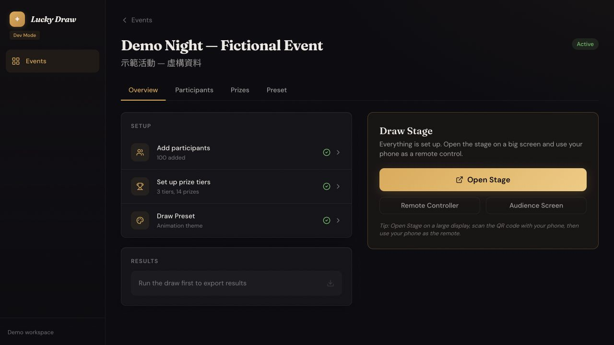
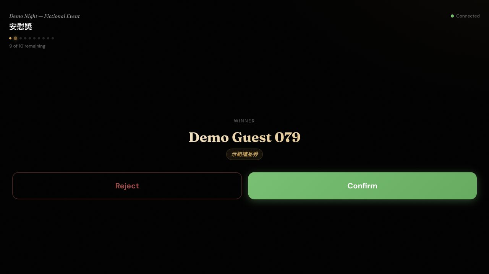

# A prize draw, in four steps

Lucky Draw helps an organizer prepare the event, a host run it from a phone, and the room follow the result. These are real app captures with entirely fictional data. No video is needed to follow the flow.

## 1. Prepare the event

The organizer adds guests and prizes, then opens the remote, stage and audience links. For a trial, the [safe demo seed](QUICKSTART.md) supplies everything. The organizer screenshot shows a separately prepared fictional event with the same seed configuration.

## 2. Give the host the controls

The host selects a round and taps DRAW. When a guest is selected, the host decides whether to award the prize. Confirm requires a second tap. Reject makes the prize available again; the rejected guest stays eligible.

## 3. Let the room follow

The phone, stage and audience screenshots show the same result, captured separately. Shared backend state supplies the selected guest; each display animates locally. This is not a frame-synchronization guarantee.

## 4. Resolve and keep a record

Confirmation decreases the remaining-prize count. Draw, confirm and reject operations write backend log entries. Authenticated organizers have a confirmed-winner CSV export path; the dashboard does not yet show a winner list or full audit history.

The local walkthrough verified drawing, confirming, rejecting and the resulting count changes. It did not verify authenticated export, payment, physical devices or event-scale reliability. See [engineering evidence and boundaries](ENGINEERING.md) before using real event data.

## What this demonstrates

- A workflow designed around different responsibilities: preparation, hosting and presentation.
- Shared state across multiple screens, with a human decision before an award is final.
- Explicit recovery behavior when a result is rejected.
- A documented distinction between a working prototype and operational readiness.

[Try the fictional event](QUICKSTART.md) · [Current improvement priorities](ROADMAP.md) · [Back to the project](../README.md)
