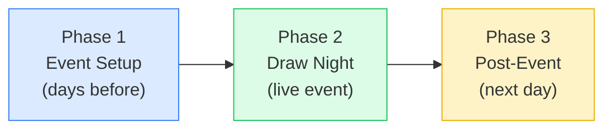
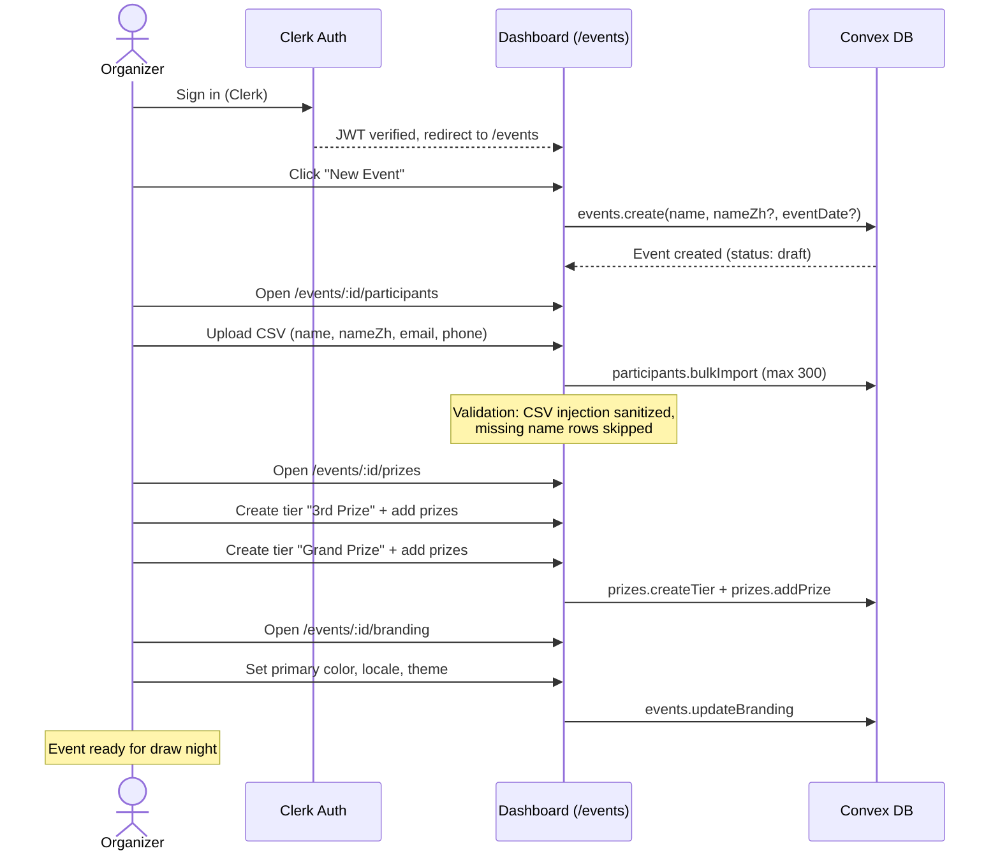
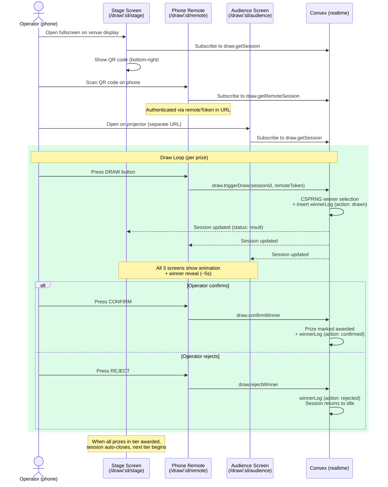
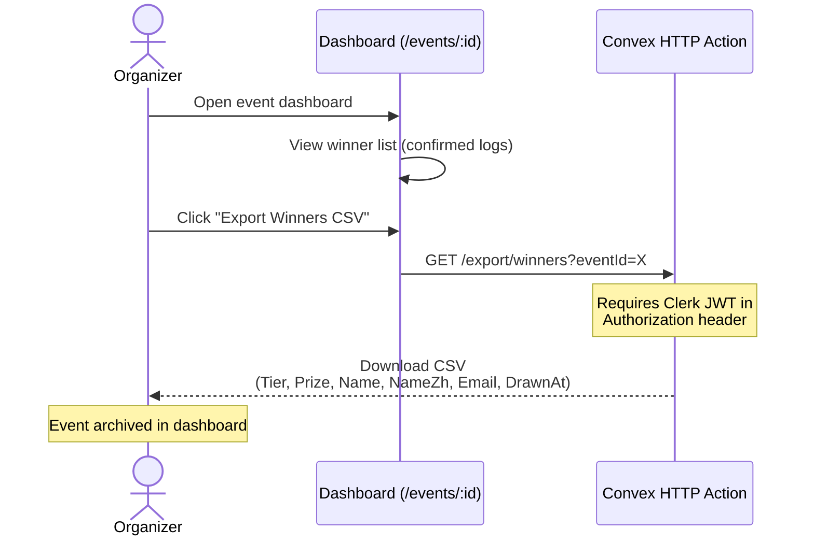
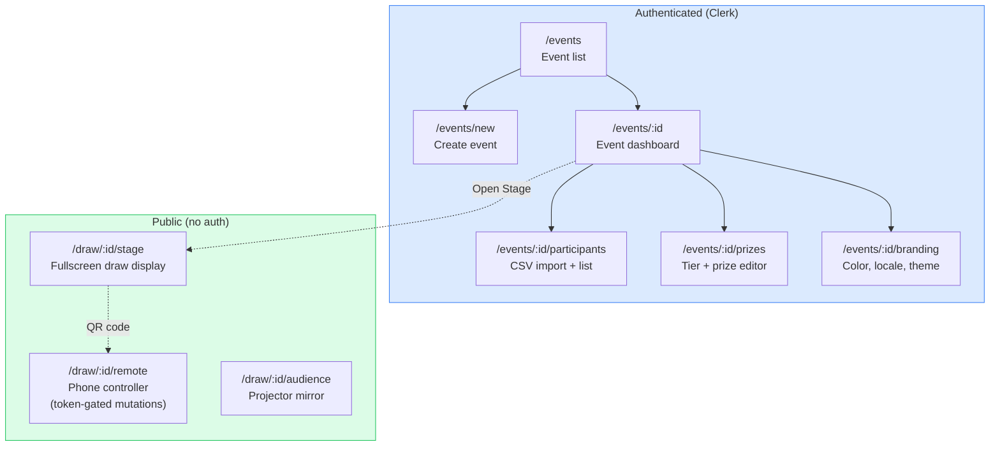

# Lucky Draw — User Journey Maps

> **Last updated:** 2026-04-08
> **Scope:** MVP as built (Convex backend, Clerk auth)

---

## Overview

---

## Phase 1: Event Setup (days before)

**MVP capabilities:** Create event, CSV import (max 300), manual participant add, prize tiers with individual prizes, branding (color, locale, theme selection).

**Not in MVP:** Stripe self-checkout (manual license activation), import from external RSVP/guest-list tools, logo upload, font selection, background video/music.

---

## Phase 2: Draw Night (live event)

**Realtime sync:** All 3 screens subscribe to the same Convex query. When a mutation fires, subscribers update automatically. No Pusher, no WebSocket management — Convex handles it.

**Security model:** Stage and Audience are read-only (no mutations). Remote mutations require `remoteToken` (128-bit UUID), only obtainable by the organizer who created the session.

---

## Phase 3: Post-Event (next day)

**MVP capabilities:** View confirmed winners, export CSV with bilingual names and timestamps (HKT).

**Not in MVP:** PDF export, winner certificates, email notifications, event duplication.

---

## Screen Map

---

## Key Differences from Full Vision

| Feature | Full Vision (OBJECTIVE.md) | MVP Reality |
|---------|---------------------------|-------------|
| Payment | Stripe + FPS/PayMe self-checkout | Manual license activation |
| Participant import | CSV + manual + external RSVP-tool API + bulk paste | CSV + manual only |
| Draw modes | Single + group + elimination | Single winner only |
| Branding | Logo, video bg, music, fonts, sponsor reel | Color, locale, theme |
| Export | PDF certificates + audit CSV | Winner CSV only |
| Roles | Owner / admin / operator | Single user per org |
| Trial mode | 10-participant sandbox, watermarked | Not implemented |
| Speed presets | Slow / normal / fast / drama | Per-theme fixed timings |
| Offline fallback | Client-side draw if API fails | No offline support |
