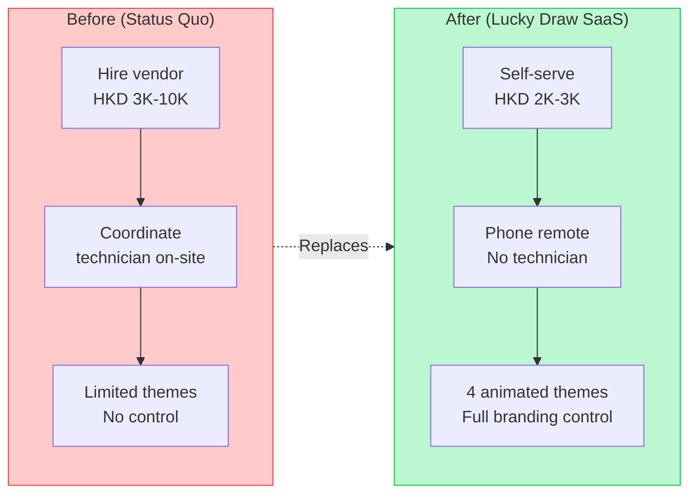

# Lucky Draw — Product Objective

> **Last updated:** 2026-04-08

---

## Mission

Eliminate the HKD 3,000-10,000 per-event cost and on-site technician dependency for Hong Kong event lucky draws, replacing it with a self-serve SaaS that any non-technical organizer can operate solo from their phone.

## Vision

A world-class animated lucky draw experience at HKD 2,000-3,000/event. No app to install, no vendor to coordinate, no IT person on-site. The organizer opens a URL on the venue display, scans a QR code with their phone, and runs the entire draw from their pocket.

## Target User

- **Primary:** HK corporate event organizers (annual dinners, gala events, product launches)
- **Secondary:** PR agencies running multiple events per month
- **Tertiary:** Charity gala planners, school/community event organizers
- **Profile:** Non-technical, currently hiring vendors like Searix at HKD 3K-10K per event, bilingual (English + Traditional Chinese)

## Value Proposition

## Product Principles

1. **Draw integrity is non-negotiable** — CSPRNG winner selection, audit seed logged, immutable winner logs
2. **Phone-first remote** — the organizer's phone IS the controller. No keyboard needed at the venue.
3. **Zero-install** — browser-only for operator, audience, and projector display
4. **Bilingual by default** — English + Traditional Chinese on all user-facing surfaces
5. **PDPO compliant** — participant PII (email, phone) protected by auth guards, exportable for audit

## Current Status

**MVP built, release BLOCKED.** Core architecture and draw experience implemented with 4 animated themes (Galaxy, Lucky Balls, Crystal, Cyber), 3 synchronized screens, and Convex realtime backend. However, 2 showstopper bugs block all draw functionality and 2 security vulnerabilities block production use with real PII.

See [TODO.md](./TODO.md) for the full prioritized backlog (31 items across 6 priority levels).
