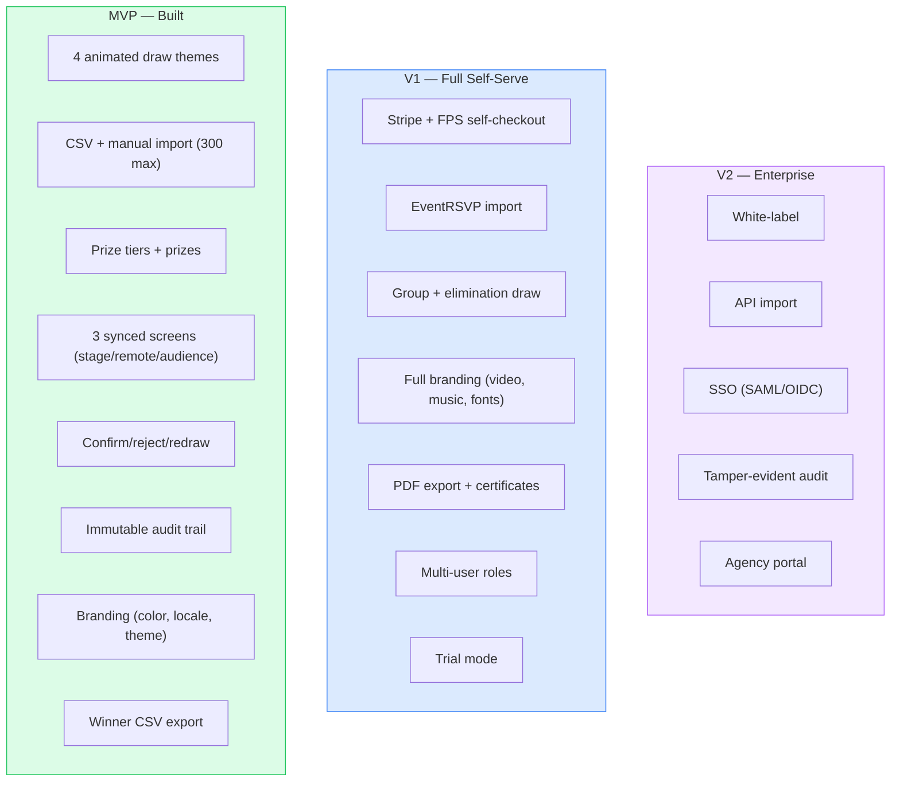

# Lucky Draw — Product Requirements Document

> **Last updated:** 2026-04-08
> **Scope:** MVP as built + V1/V2 roadmap

---

## Scope Tiers

---

## MVP Feature Matrix

Status key: **Built** = code exists and works | **Built (BLOCKED)** = code exists but broken (see [TODO.md](./TODO.md)) | **Partial** = partially implemented

### Draw Engine

| Feature | Status | Acceptance Criteria |
|---------|--------|---------------------|
| Single winner mode | Built (BLOCKED by SDET-C1) | Operator presses DRAW, one winner selected via CSPRNG, revealed with animation |
| 4 animated themes | Built | Galaxy (WebGL nebula), Lucky Balls (Canvas lottery drum), Crystal (WebGL sphere shatter), Cyber (Canvas matrix rain) |
| Theme selection per event | Built | Organizer selects theme in branding page, draw screens render chosen theme |
| Animation phases | Built | Each theme has idle -> accelerate -> hold -> decelerate -> reveal phases with configurable timings |
| Rate limiting | Built | Minimum 3s between draws enforced server-side |
| CSPRNG selection | Built (BLOCKED by SDET-C1) | `crypto.getRandomValues` used for winner index. Algorithm + seed logged in session for audit. |

**Not in MVP:** Group draw, elimination mode, speed presets, suspense mode, sandbox/preview, keyboard shortcuts.

### Participant Management

| Feature | Status | Acceptance Criteria |
|---------|--------|---------------------|
| CSV import | Built | Upload .csv with name, nameZh, email, phone columns. PapaParse parsing. CSV injection sanitized. |
| Manual entry | Built | Add single participant via form (name required, nameZh/email/phone optional) |
| Participant cap | Built | Server enforces max 300 per event |
| Delete participant | Built | Remove individual participant with auth check |
| Bilingual names | Built | name (English) + nameZh (Traditional Chinese) stored and displayed |

**Not in MVP:** EventRSVP import, bulk paste, duplicate detection, custom tags, check-in filter, search/filter.

### Prize Management

| Feature | Status | Acceptance Criteria |
|---------|--------|---------------------|
| Prize tiers | Built | Create named tiers with draw order. Tiers drawn in sequence. |
| Prizes per tier | Built | Add individual prizes to tiers (name, nameZh, description) |
| Tier reorder | Built | Swap draw order of adjacent tiers (up/down) |
| Delete tier | Built | Remove tier and cascade-delete all prizes in it |
| Delete individual prize | Partial (UX-H2) | `removePrize` mutation exists but no UI delete button |
| No-repeat winner | Built | Per-tier `allowRepeat` flag. If false, confirmed winners excluded from subsequent draws in that tier. |
| Prize status tracking | Built | `isAwarded` boolean on each prize, updated on confirm |

**Not in MVP:** Prize images, value display, pool assignment (VIP-only, tag-based), prize sequence display.

### Branding & Customization

| Feature | Status | Acceptance Criteria |
|---------|--------|---------------------|
| Primary color | Built | Hex color picker, applied to draw animations and UI accents |
| Locale | Built | English / zh-HK / both — controls which name fields are displayed |
| Theme selection | Built | Choose from 4 draw themes (galaxy, luckyballs, crystal, cyber) |
| Logo URL | Built (schema) | Field exists in schema but no upload UI (post-MVP: Cloudflare R2) |

**Not in MVP:** Secondary color, video/image background, font selection, music/sound effects, sponsor reel, countdown, custom tagline.

### Presenter Mode (Stage / Remote / Audience)

| Feature | Status | Acceptance Criteria |
|---------|--------|---------------------|
| Fullscreen stage | Built | Black background, animation fills screen, tier info at top |
| QR code for remote | Built | QR code displayed on stage (bottom-right) encoding remote URL with token |
| Phone remote controller | Built | DRAW / CONFIRM / REJECT buttons. Token-gated mutations. |
| Audience screen | Built | Same animation as stage, read-only (no operator buttons) |
| Realtime sync | Built | All 3 screens update via Convex reactive queries |
| Prize progress | Built | "X of Y prizes awarded" dots displayed on stage |
| Tier label | Built | Current tier name displayed at top of stage |

**Not in MVP:** Keyboard shortcuts, timer overlay, emergency stop, low-bandwidth mode, live participant count.

### Winner Management

| Feature | Status | Acceptance Criteria |
|---------|--------|---------------------|
| Confirm winner | Built | Operator presses Confirm on remote. Prize marked awarded. WinnerLog entry (confirmed). |
| Reject winner | Built | Operator presses Reject. Prize stays unawarded. WinnerLog entry (rejected). Session returns to idle. |
| Auto-advance | Built (BLOCKED by SDET-C2) | When all prizes in tier awarded, session closes, next tier begins automatically. Broken because closeSession doesn't exist. |
| Winner name on remote | Partial (UX-C3) | Winner name NOT shown on remote — must look at stage screen |

**Not in MVP:** Replace winner, reject with reason, winner notification (email/WhatsApp).

### Audit Trail

| Feature | Status | Acceptance Criteria |
|---------|--------|---------------------|
| Immutable WinnerLog | Built | Every draw action (drawn/confirmed/rejected) logged with timestamp. Denormalized participant + prize names. |
| Algorithm audit | Built | `algorithm` field ("fisher-yates-webcrypto-v1") + `prngSeed` (hex) stored per session |
| Winner CSV export | Built | HTTP action exports confirmed winners as CSV. Requires Clerk JWT. Columns: Tier, Prize, Name (en/zh), Email, DrawnAt (HKT). |

**Not in MVP:** Actor user ID in logs, tamper-evident hash chain, PDF certificates, IP logging.

### Billing & Licensing

| Feature | Status | Acceptance Criteria |
|---------|--------|---------------------|
| Stripe Checkout | Built | `createCheckoutSession` action creates Stripe session, returns URL |
| License activation | Built | Webhook receives `checkout.session.completed`, calls `activateLicense` (internal mutation). Sets 30-day expiry. |
| Per-event license | Built (schema) | `licenseExpiresAt` field on event. License gate not enforced on draw pages (UX-C2). |

**Not in MVP:** FPS/PayMe, agency subscription, invoice generation, trial mode, license enforcement on draw screens.

---

## V1 Additions (NOT BUILT)

| Module | Feature | Priority |
|--------|---------|----------|
| Billing | Stripe + FPS/PayMe self-checkout with license enforcement | HIGH |
| Import | EventRSVP API integration (OAuth + guest import) | HIGH |
| Draw Engine | Group draw mode (N winners simultaneously) | MEDIUM |
| Draw Engine | Elimination mode (last N standing win) | MEDIUM |
| Branding | Full suite: video bg, music, fonts, sponsor reel, tagline | MEDIUM |
| Export | Branded winner PDF + full audit CSV | MEDIUM |
| Auth | Multi-user org: owner / admin / operator roles | MEDIUM |
| CMS | Event duplication (clone settings + prizes) | LOW |
| CMS | Trial mode (10 participants, watermarked, no persistence) | LOW |
| CMS | Bilingual CMS UI (EN + zh-HK) | LOW |
| Presenter | Low-bandwidth mode, session recovery, keyboard shortcuts | LOW |

---

## V2 Additions (NOT BUILT)

| Module | Feature |
|--------|---------|
| Enterprise | White-label (custom domain, remove branding) |
| API | POST /api/v1/events/:id/participants for external systems |
| Integration | Webhook on winner confirmed (CRM integration) |
| Security | Tamper-evident audit log (hash chain) |
| Auth | Enterprise SSO (SAML 2.0 / OIDC) |
| Data | Dedicated database instance (HK data residency for PDPO enterprise) |
| Notification | Winner email/WhatsApp post-event |
| Analytics | Draw session stats, participant engagement report |
| Agency | Reseller portal: manage sub-orgs, consolidated billing |

---

## Non-Functional Requirements

| Requirement | Target | Status |
|-------------|--------|--------|
| Realtime sync latency | < 200ms (3 screens) | Built (Convex reactive queries; not formally measured) |
| Participant cap | 300 per event | Built (server-enforced) |
| Browser-only | No app install for any user | Built |
| Session recovery | Restore state after page refresh | Built (Convex subscription reconnects) |
| Concurrent events | Multiple orgs, simultaneous draws | Built (Convex multi-tenant) |
| Draw fairness | CSPRNG, logged seed, no Math.random() | Built (BLOCKED by SDET-C1 runtime issue) |

---

## Pricing Model (MVP)

| Plan | Price | Access |
|------|-------|--------|
| Per-event license | HKD 2,000-3,000 | 30-day access to one event's draw screens |
| Agency subscription | HKD 800-1,200/mo (V1) | Unlimited events, multi-user org |

MVP billing: Stripe Checkout for per-event license. Manual activation via webhook. No FPS/PayMe.
