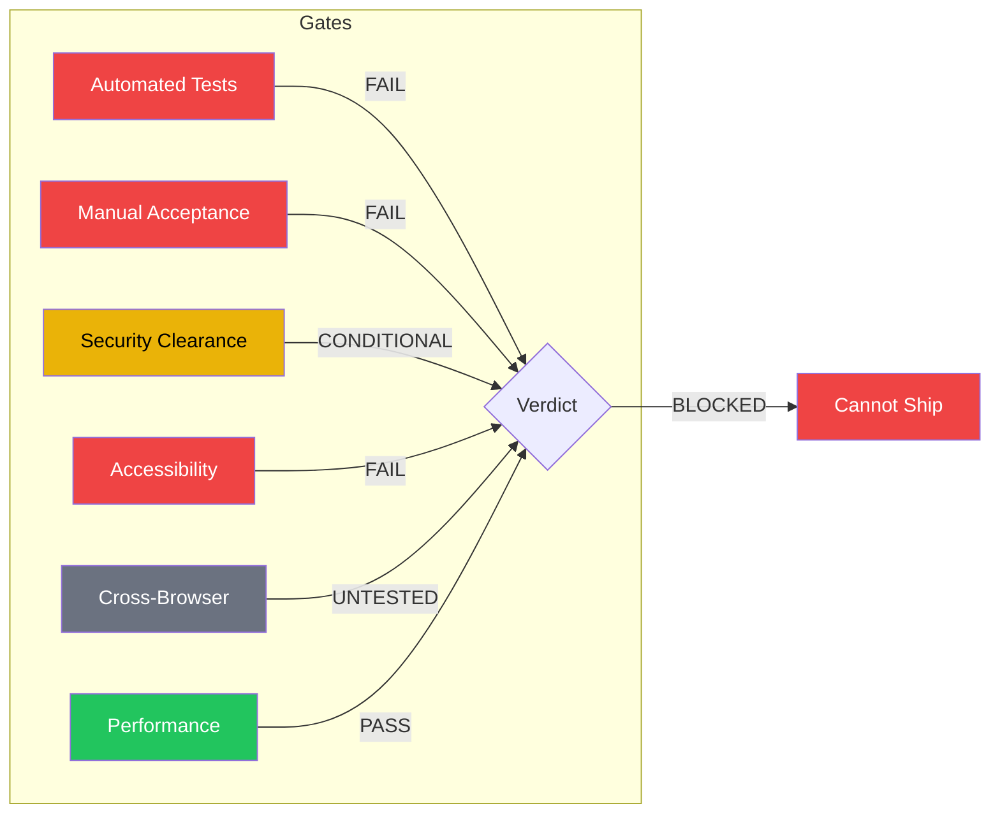

# Lucky Draw — Quality Assurance

> **HISTORICAL SNAPSHOT (2026-04-08)** — this is the QA gate from the original MVP
> build, kept as process evidence. Superseded: the showstopper draw bugs were fixed
> in later development (the full draw flow — trigger, animation, reveal,
> confirm/reject — runs end to end), and the two access-control vulnerabilities
> (VULN-001/002) were patched on 2026-08-05; see
> [SECURITY_REVIEW_FINDINGS.md](./SECURITY_REVIEW_FINDINGS.md) for current status.
> The "BLOCKED" verdict below describes the 2026-04-08 state, not the current one.

The Lucky Draw MVP had, at the time of this snapshot, **2 showstopper bugs** making the core draw non-functional, **2 must-fix security vulnerabilities** (PDPO data breach risk), and **14 additional critical/high UX bugs**. Zero integration or E2E test coverage. Full bug tracker in [TODO.md](./TODO.md).

---

## Release Gate Checklist

| Gate | Status | Blocker Count |
|------|--------|---------------|
| Automated Tests | **FAIL** | 5 CRITICAL, 5 HIGH, 4 MEDIUM |
| Manual Acceptance | **FAIL** | 3 CRITICAL, 5 HIGH UX bugs |
| Security Clearance | **CONDITIONAL** | 2 must-fix, 3 should-fix vulns |
| Accessibility (WCAG AA) | **FAIL** | 8 findings, 6 are AA failures |
| Cross-Browser | **UNTESTED** | 4 known risks from code analysis |
| Performance | **PASS** | No blockers at 300 participants |

---

## Showstopper Bugs

| ID | Bug | Impact |
|----|-----|--------|
| SDET-C1 | `crypto.getRandomValues` unavailable in Convex runtime | Draw is 100% broken. No winner is ever selected. |
| SDET-C2 | No `closeSession` mutation exists | Multi-tier draws permanently broken. Only Tier 1 works. |

---

## Security Vulnerabilities

| ID | CVSS | Finding | Must Fix? |
|----|------|---------|-----------|
| VULN-001 | 7.5 | `participants.list` — unauthenticated PII exfiltration (email, phone) | YES |
| VULN-002 | 6.5 | `winnerLogs.listConfirmed` — unauthenticated winner email leak | YES |
| VULN-003 | 4.3 | `events.get/list` — metadata disclosure without auth | Pre-launch |
| VULN-004 | 3.1 | `remoteToken` has no expiry/rotation | Backlog |
| VULN-005 | 2.7 | `createCheckoutSession` — no ownership check | Backlog |

**Security conditions C1-C4 (org ownership, license bypass, PII projection, CSV auth) all PASS.** Core draw integrity is architecturally sound. The above vulnerabilities are access control gaps on read queries.

---

## Test Coverage

| Category | Files | Coverage |
|----------|-------|----------|
| Unit tests (pure functions) | `draw-algorithm.test.ts`, `csv-parser.test.ts` | 10 tests passing |
| Integration tests (Convex mutations) | None | **Zero coverage** on `triggerDraw`, `confirmWinner`, `rejectWinner` |
| E2E tests (Playwright/Cypress) | None | **Zero coverage** on 3-screen draw flow |
| Component tests | None | **Zero coverage** on `DrawEngine`, `WinnerCard`, themes |

**Critical gap:** `lib/draw-algorithm.ts` (the tested file) is **dead code** — `triggerDraw` implements its own inline selection logic, not imported from this lib.

---

## Accessibility Summary (WCAG 2.1 AA)

| Finding | WCAG | Status |
|---------|------|--------|
| Color-only status badges | 1.4.1 | FAIL |
| Text contrast (`text-white/25-40`) | 1.4.3 | FAIL |
| Focus rings suppressed (`focus:outline-none`) | 2.4.7 | FAIL |
| Touch targets < 44px (trash buttons) | 2.5.5 | FAIL |
| No `aria-live` for draw announcements | 4.1.3 | FAIL |
| No skip navigation link | 2.4.1 | FAIL |
| Form labels missing `htmlFor` | 1.3.1 | PARTIAL |
| Decorative icons missing `aria-hidden` | 1.1.1 | PARTIAL |

---

## Cross-Browser Risks

| Risk | Severity | Platform |
|------|----------|----------|
| `<input type="color">` renders differently | MEDIUM | iOS Safari |
| `min-h-screen` doesn't account for browser chrome | MEDIUM | Mobile Safari |
| WebSocket reconnection delay after phone sleep | LOW | Safari |
| `<select>` styling ignored | LOW | Safari |

**No live browser testing has been performed.** All findings are from static code analysis. Live testing on Chrome, Safari (iOS), and Firefox is **required** before acceptance.

---

## Detail References

| Document | Contents |
|----------|----------|
| [TODO.md](./TODO.md) | Full prioritized bug tracker (single source of truth) |
| [SECURITY_REVIEW_FINDINGS.md](./SECURITY_REVIEW_FINDINGS.md) | Security code review (VULN-001 through VULN-005) |
| [CODE_REVIEW.md](./CODE_REVIEW.md) | File-by-file code review + security checklist |
| [BUG_REPORTS.md](./archive/qa/BUG_REPORTS.md) | 14 UX bugs with repro steps |
| [ACCESSIBILITY_AUDIT.md](./archive/qa/ACCESSIBILITY_AUDIT.md) | WCAG 2.1 AA findings (A11Y-001 to A11Y-008) |
| [CROSS_BROWSER_MATRIX.md](./archive/qa/CROSS_BROWSER_MATRIX.md) | Browser compatibility risks (RISK-001 to RISK-004) |
| [EXPLORATORY_TEST_REPORT.md](./archive/qa/EXPLORATORY_TEST_REPORT.md) | Manual exploratory test results |
| [ACCEPTANCE_SIGN_OFF.md](./archive/qa/ACCEPTANCE_SIGN_OFF.md) | Stakeholder acceptance criteria |
| [THREAT_MODEL.md](./archive/security/THREAT_MODEL.md) | Attack surface analysis |
| [SECURITY_REQUIREMENTS.md](./archive/security/SECURITY_REQUIREMENTS.md) | REQ-01 through REQ-13 checklist |
