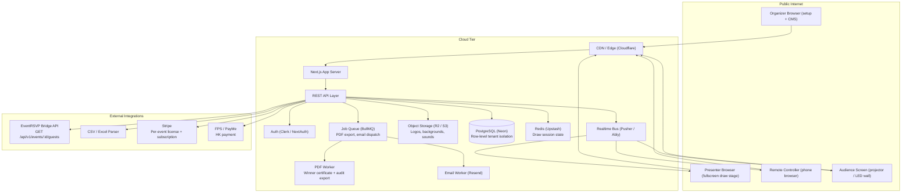
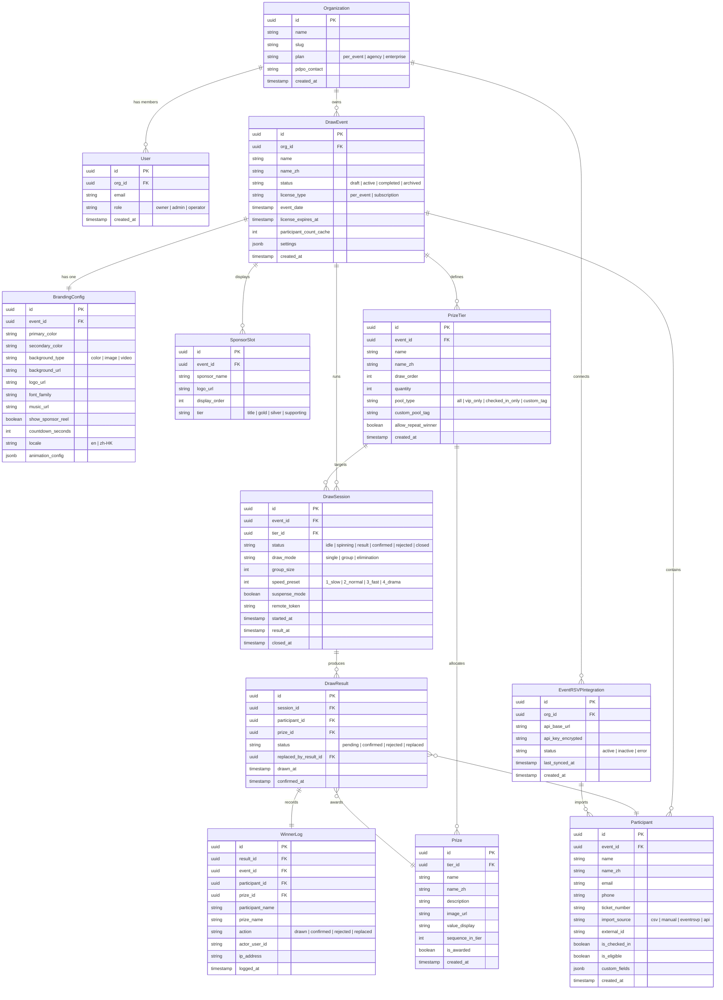
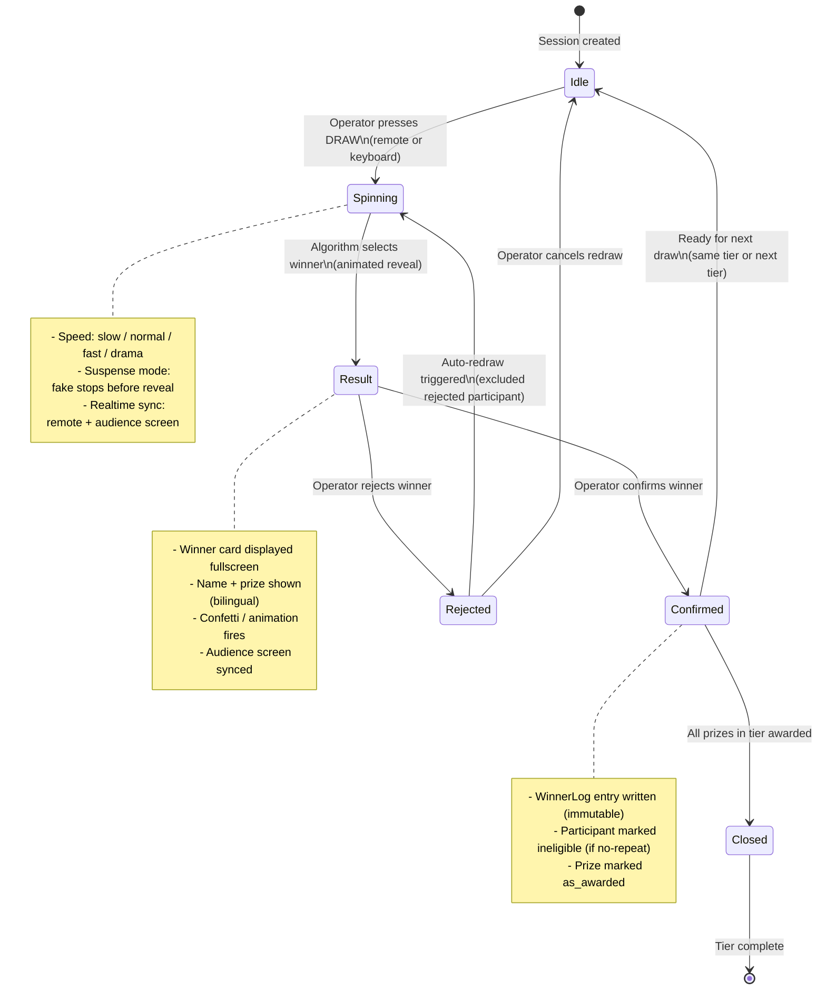
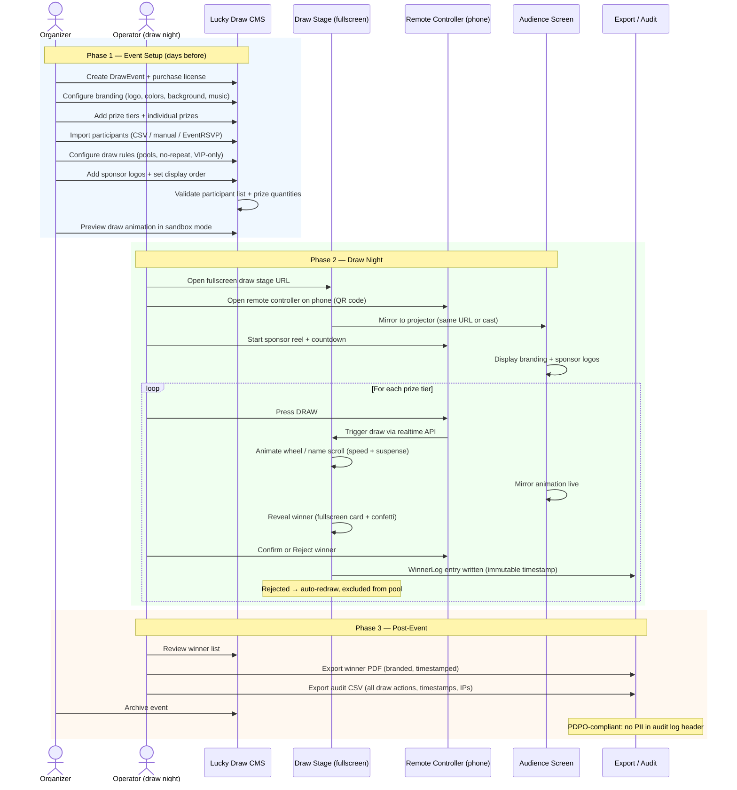

> **SUPERSEDED:** This document contains the original full-vision product scope (V1/V2/V3) with references to the pre-Convex tech stack (PostgreSQL, Pusher, Redis). For current documentation, see the root-level document suite: [OBJECTIVE.md](../../../OBJECTIVE.md), [PRD.md](../../../PRD.md), [JOURNEY.md](../../../JOURNEY.md).

# Lucky Draw — Comprehensive Product Scope (ARCHIVED)

## Objective

Build a self-serve, fully brandable lucky draw SaaS for the Hong Kong event market that eliminates the HKD 3,000–10,000 per-event cost and on-site technician dependency, replacing it with a world-class animated draw experience at HKD 2,000–3,000/event that any event organizer can operate solo.

---

## System Architecture Diagram

---

## Entity Relationship Diagram

---

## Draw Session State Machine

---

## User Journey: Event Setup to Draw Night to Winner Export

---

## Scope

- **IN:**
  - Full draw engine with animation, speed modes, and suspense mode
  - Guest/participant management (CSV, manual, EventRSVP import)
  - Prize tiers and prize management
  - Branding and customization per event
  - Presenter mode (fullscreen draw stage)
  - Remote controller (phone-based, no app install)
  - Winner management (confirm/reject/redraw)
  - Immutable audit trail (WinnerLog)
  - Sponsor management
  - Export (PDF certificate, CSV audit)
  - Per-event license + agency subscription billing
  - Multi-event admin dashboard
  - PDPO-compliant data handling

- **OUT (not in this scope):**
  - EventRSVP full feature set (separate product)
  - Live streaming integration
  - Physical ticket printing / NFC integration
  - Native iOS/Android app (web-first)
  - White-label reseller portal (V2)
  - Public voting / audience participation mode
  - Payment processing for ticket sales (draw product only)

---

## Full Feature List by Module

### Module 1 — Draw Engine

| Feature | Description |
|---|---|
| Animated name roll | Names scroll/spin at configurable speed; GPU-accelerated CSS/canvas |
| Speed presets | Slow / Normal / Fast / Drama — controls scroll velocity and deceleration curve |
| Suspense mode | Fake-stops 2–3 times before final reveal; builds tension |
| Countdown before draw | Configurable 3–10 second countdown with audio cue |
| Group draw mode | Draw N winners simultaneously (e.g. table draw for 10 seats) |
| Single winner mode | Default; one winner per draw trigger |
| Elimination mode | Winners removed from pool after each draw; final N remaining win |
| Instant reveal | Skip animation, reveal winner immediately (practice / dry-run use) |
| Draw speed remote control | Operator can slow down / speed up live during spin |
| Sandbox / preview mode | Organizer tests animation before event; no WinnerLog writes |

### Module 2 — Participant Management

| Feature | Description |
|---|---|
| CSV / Excel import | Upload .csv or .xlsx; column mapping UI; validation + error report |
| Manual entry | Add participants one by one via form |
| Bulk paste | Paste names from clipboard (newline-separated) |
| EventRSVP import | "Import from EventRSVP" button; OAuth token; calls GET /api/v1/events/:id/guests |
| API import (V2) | POST /api/v1/events/:id/participants for external systems |
| Duplicate detection | Flag exact email/phone duplicates on import |
| Eligibility rules | Mark participants ineligible (e.g. staff, VIPs excluded from certain tiers) |
| Custom tags | Tag participants (e.g. "VIP", "table-1") for pool filtering |
| Check-in filter | Use check-in status as pool filter (checked-in only draws) |
| Participant search | Search/filter in management view |
| Edit / delete | Organizer can edit or remove participants before event goes live |

### Module 3 — Prize Management

| Feature | Description |
|---|---|
| Prize tiers | Ordered tiers (e.g. 3rd Prize → 2nd Prize → Grand Prize) with draw order |
| Prize items per tier | Multiple prizes per tier (e.g. 5 × 3rd Prize); individual names, images, values |
| Prize images | Upload prize photo; displayed on winner card and audience screen |
| Prize value display | Optional "Valued at HKD X" string on winner card |
| Tier pool assignment | Each tier draws from: all participants / VIP-only / checked-in-only / custom tag |
| No-repeat winner rule | Per-tier or global: a participant can only win once |
| Prize sequence | Within a tier, prizes can be awarded in order (Prize 1 of 5, Prize 2 of 5…) |
| Prize status | Unawarded / Awarded / Voided — tracked in real time |

### Module 4 — Branding & Customization

| Feature | Description |
|---|---|
| Client logo | Upload; displayed on draw stage header, winner card, PDF export |
| Primary + secondary color | Theme color applied across draw stage UI |
| Background | Solid color / image upload / video loop (mp4) |
| Font selection | 6 curated font pairs (Latin + Traditional Chinese) |
| Winner card design | Configurable layout: portrait / landscape; name size; prize prominence |
| Background music | Upload MP3 or select from built-in library (5 tracks) |
| Sound effects | Spin start / suspense tick / reveal fanfare — toggle on/off individually |
| Sponsor reel | Auto-playing sponsor logo slideshow before draw starts |
| Locale | English / Traditional Chinese / bilingual (name displayed in both) |
| Custom event tagline | Short line displayed on stage (e.g. "Annual Dinner 2026") |
| Branding preview | Live preview in CMS before going to event |

### Module 5 — Presenter Mode (Draw Stage)

| Feature | Description |
|---|---|
| Fullscreen mode | Single-click fullscreen; hides all browser chrome |
| Audience screen URL | Separate URL for projector / LED wall (no controls, just the stage) |
| Remote controller | Phone-accessible URL (QR code); buttons: DRAW / CONFIRM / REJECT / NEXT TIER |
| Keyboard shortcuts | Space = draw, Enter = confirm, Esc = reject; for laptop operators |
| Live participant count | Shows remaining eligible participants per tier |
| Prize progress indicator | "3 of 5 prizes awarded" displayed on stage |
| Tier navigation | Operator advances through prize tiers manually or auto-advance |
| Timer overlay | Optional countdown / elapsed time overlay on stage |
| Emergency stop | Halt draw mid-animation; return to idle without recording result |
| Low-bandwidth mode | Reduce animation fidelity; disables video bg; works on 3G |

### Module 6 — Exclusion Rules

| Feature | Description |
|---|---|
| No-repeat winner | Winner excluded from all subsequent draws (global rule) |
| No-repeat per tier | Winner excluded from the same tier only |
| Manual exclude | Organizer marks specific participants as ineligible before event |
| Real-time exclude | Operator excludes a participant live during event (e.g. they left) |
| Tag-based pools | Only participants with a specific tag are eligible for a given tier |
| Check-in gate | Only checked-in participants are eligible (requires check-in data) |
| Staff exclusion | Bulk-exclude a CSV list of staff names/emails |

### Module 7 — Winner Management

| Feature | Description |
|---|---|
| Confirm winner | Operator presses Confirm; WinnerLog entry written; prize marked awarded |
| Reject winner | Operator presses Reject; participant excluded; auto-redraw triggered |
| Reject with reason | Optional reason field (logged in audit trail) |
| Replace winner | After confirmation, swap a winner (requires admin role; logged) |
| Winner list view | Real-time updating list in CMS during event |
| Winner notification (V2) | Send winner's name/prize via email/WhatsApp post-event |

### Module 8 — Audit Trail

| Feature | Description |
|---|---|
| Immutable WinnerLog | Every draw action timestamped at server level; no client-editable fields |
| Action types | drawn / confirmed / rejected / replaced — each logged separately |
| Actor logging | Which user triggered each action (user_id, IP) |
| Timezone | All timestamps in HKT (UTC+8) |
| Tamper-evident (V2) | Hash chain on WinnerLog for enterprise compliance |
| Audit export | Full WinnerLog as CSV with all columns |
| Winner certificate PDF | Branded PDF per winner: name, prize, event, timestamp |
| Bulk winner export | All winners in one PDF (draw results report) |

### Module 9 — Sponsor Management

| Feature | Description |
|---|---|
| Sponsor slots | Unlimited sponsors per event |
| Tier labels | Title Sponsor / Gold / Silver / Supporting — affects logo size on reel |
| Logo upload | PNG/SVG; auto-background-removal for dark-stage display |
| Display order | Drag-to-reorder in CMS |
| Reel duration | Configurable seconds per sponsor on reel |
| Static overlay | Optional persistent small sponsor bar at bottom of draw stage |

### Module 10 — CMS (Event Setup & Management)

| Feature | Description |
|---|---|
| Event dashboard | Overview: participant count, prize count, draw progress, license expiry |
| Multi-event list | All events for the org with status badges |
| Event duplication | Clone a previous event's settings + prizes (not participants) |
| Role-based access | Owner / Admin / Operator — Operators cannot edit settings during live event |
| Event locking | Lock settings once event goes live (prevent accidental edits) |
| Event archiving | Archive post-event; data retained per PDPO retention schedule |
| Bilingual CMS | English + Traditional Chinese UI |

### Module 11 — Billing & Licensing

| Feature | Description |
|---|---|
| Per-event license | HKD 2,000–3,000; 30-day access window; unlocks one DrawEvent |
| Agency subscription | HKD 800–1,200/mo; unlimited events; multi-user org |
| Stripe checkout | Card payments for international clients |
| FPS / PayMe | Local HK payment for per-event and subscription |
| License enforcement | Event stage locked if license expired; CMS read-only |
| Invoice generation | Auto-generated PDF invoice per purchase |
| Trial mode | 10-participant sandbox; watermarked export; no WinnerLog persistence |

### Module 12 — Performance & Reliability

| Feature | Description |
|---|---|
| Offline-tolerant draw | Draw algorithm runs client-side if API call fails; syncs on reconnect |
| No app install | 100% browser-based; tested on Chrome / Safari iOS |
| Weak WiFi mode | Low-bandwidth preset auto-detected; reduces asset payload |
| Session recovery | If operator refreshes mid-draw, session state restored from server |
| Concurrent events | Multiple orgs can run simultaneous events on shared infra |
| Realtime sync | Remote + audience screen updates within 200ms of draw trigger |

---

## Build Sequence

### MVP — First Paying Event

**Goal:** Ship to one real paying client. Manual setup OK. Core draw works perfectly.

**Scope:**
- DrawEvent create/edit (single event, manually provisioned by team)
- Participant import: CSV + manual entry only
- Prize tiers + prizes (name, quantity, image)
- Draw engine: single winner mode, 2 speed presets (normal + drama), suspense mode
- Branding: logo, primary color, background image
- Draw stage: fullscreen, keyboard shortcuts, audience URL
- Remote controller: phone browser (DRAW / CONFIRM / REJECT)
- No-repeat winner rule (global)
- WinnerLog (basic, server-side)
- Winner list view in CMS
- Export: winner CSV
- Auth: single user per org (no roles yet)
- Billing: manual invoice (no Stripe integration yet)

**Acceptance criteria:**
- A non-technical organizer can run a complete draw for 300 participants, 3 prize tiers, from phone remote without any team support
- WinnerLog is written and exportable

**Estimated scope:** 3–4 weeks, 1 full-stack developer

---

### V1 — Full Self-Serve Launch

**Goal:** Any organizer can sign up, pay, and run a draw without touching the team.

**Additional scope over MVP:**
- Stripe + FPS/PayMe billing + per-event license enforcement
- EventRSVP import (OAuth + API bridge)
- All draw modes (single, group, elimination)
- All exclusion rules (tag-based pools, check-in filter, manual exclude)
- Full branding suite (video bg, music, fonts, sponsor reel, custom tagline)
- Presenter mode: timer overlay, live participant count, tier progress
- Winner management: replace winner (admin), reject with reason
- Export: winner PDF (branded), audit CSV (full WinnerLog)
- Multi-user org (owner / admin / operator roles)
- Event duplication (clone settings + prizes)
- Trial mode (watermarked, 10-participant sandbox)
- Bilingual CMS + draw stage (EN + 繁中)
- Low-bandwidth mode
- Session recovery
- Full audit trail per PDPO requirement

**Acceptance criteria:**
- End-to-end: new user signs up → pays per-event → imports guests → runs full draw → exports winner PDF, all without team intervention
- Load test: 500 participants, 10 prize tiers, remote + audience screen, under 200ms realtime sync

**Estimated scope:** 8–10 weeks additional

---

### V2 — Enterprise, White-Label, API

**Goal:** Land agency subscriptions and enterprise clients (banks, corporates).

**Additional scope over V1:**
- White-label: custom domain per client, remove Lucky Draw branding
- API for participant import (POST /api/v1/events/:id/participants)
- Webhook: fire on winner confirmed (for integration with client CRMs)
- Tamper-evident audit log (hash chain on WinnerLog)
- Enterprise SSO (SAML 2.0 / OIDC)
- Dedicated database instance option (HK data residency for PDPO enterprise)
- Winner notification: email/WhatsApp post-event
- Advanced analytics: draw session stats, participant engagement report
- Reseller/agency portal: manage sub-orgs, consolidated billing
- Multi-language expansion: Simplified Chinese

**Acceptance criteria:**
- Agency can manage 10 sub-client events from one dashboard
- Enterprise client can prove full WinnerLog chain-of-custody for regulatory audit

**Estimated scope:** 12+ weeks additional

---

## Risk / Open Questions

| Risk | Impact | Mitigation |
|---|---|---|
| Venue projector runs on a locked-down browser (IE-era kiosk) | High | Test on Chrome 80+, Safari 14+; provide fallback static winner display |
| Venue WiFi drops mid-draw | High | Client-side draw algorithm fallback; session recovery from Redis |
| Organizer runs draw from same device as audience screen | Medium | Audience URL is separate; dual-screen or second device recommended in onboarding |
| EventRSVP API auth token management (shared org vs. per-user) | Medium | Abstract as OAuth integration; org-level token storage |
| PDPO: participant PII in WinnerLog | High | WinnerLog stores participant_id FK only; PII joined at query time; audit export de-identifies on request |
| Draw algorithm fairness disputes | High | Use cryptographically secure PRNG (Web Crypto API); log seed + algorithm version in DrawSession |
| Bilingual name display (Chinese name longer than English) | Low | Winner card layout tested at max-length for both locales |
| Competitor Searix undercuts on price to retain HK client | Medium | Differentiate on UX, self-serve, and HK data residency |
| License expiry mid-event (timezone edge case) | Low | Grace period: license valid until end of event_date calendar day HKT |

---

## Checklist

- [ ] ERD reviewed and approved by team — no missing relations
- [ ] Draw state machine covers all failure paths (network drop, double-confirm, etc.)
- [ ] PDPO data mapping completed — confirm which fields are PII and retention schedule
- [ ] Branding config covers all draw stage elements — no hardcoded colors remain
- [ ] Remote controller QR flow tested on iOS Safari + Android Chrome
- [ ] Audience screen URL tested on common venue projector browsers
- [ ] CSV import column mapping covers common HK event export formats (EventsAir, Cvent, Excel)
- [ ] EventRSVP API bridge endpoint confirmed with EventRSVP team (auth method, rate limits)
- [ ] WinnerLog schema reviewed for compliance — immutable fields confirmed at DB level
- [ ] Stripe + FPS payment flow tested end-to-end in sandbox
- [ ] Load test: 500 participants, simultaneous remote + audience screen, confirm <200ms sync
- [ ] Bilingual winner card renders correctly for Traditional Chinese names (max 8 chars) + English names (max 40 chars)
- [ ] Sandbox / trial mode confirmed: no WinnerLog persistence, watermark visible on export
- [ ] Run lint + types + build (zero errors, zero warnings)
- [ ] Visual verification: draw animation on 1080p projector resolution + 4K display
- [ ] Check empty states: no participants, no prizes, expired license
